## 第0章 基础

**JavaScript**是面向对象的高级多范式编程语言

书写方式:

1. 驼峰表达式`firstName`

2. 下划线表达式`first_name`

> 1. 允许开头的内容:`$``_`
> 
> 2. 数字不能开头
> 
> 3. 见名知意

#### 1. 数据类型:

| 类型名       | 类型说明                                                                        | 类型示例                       |
| --------- | --------------------------------------------------------------------------- | -------------------------- |
| Number    | 数字类型(整数、浮点数)                                                                | `let age = 23;`            |
| String    | 字符串类型(单引号、双引号表示均可)                                                          | `let firstName = "Jonas";` |
| Boolean   | 布尔类型(表示`true`或`false`)                                                      | `let fullAge = true;`      |
| Undefined | 未定义类型,表达变量未定义,类似`空值`                                                        | `let children;`            |
| Null      | 表示`空值`,类型应该也是`undefined`,但`bug`的存在，使得null的类型为`Object`,**与Undefined类型不完全相同** |                            |
| Symbol    | ES2015引入，表示一个唯一的值，且无法变更(基本无用)                                               |                            |
| BigInt    | ES2020引入，表示一个数字巨大的`Number`类型                                                |                            |

*特别地，`JavaScript`能够动态定义数据类型，且在实践中，能够随意改变变量的数据类型*

#### 2. 声明类型:

| 声明名   | 声明说明                | 声明示例              |
| ----- | ------------------- | ----------------- |
| let   | ES6引入,变量值可以随意更改     | `let age = 21;`   |
| const | ES6引入,变量值不可更改       | `const age = 20;` |
| var   | ES5的声明方式,遗弃状态，不推荐使用 | `var age = 19;`   |
| 不声明   | 拒绝如此                | `age = 18;`       |

#### 3. 运算符:

- 算术类型:`+ - * / += -= ** ++ --`

- 比较类型:`> < >= <=`

#### 挑战一.BMI

```js
// Coding Challenge #1

/*
Mark and John are trying to compare their BMI (Body Mass Index), which is calculated using the formula: BMI = mass / height ** 2 = mass / (height * height). (mass in kg and height in meter).

1. Store Mark's and John's mass and height in variables
2. Calculate both their BMIs using the formula (you can even implement both versions)
3. Create a boolean variable 'markHigherBMI' containing information about whether Mark has a higher BMI than John.

TEST DATA 1: Marks weights 78 kg and is 1.69 m tall. John weights 92 kg and is 1.95 m tall.
TEST DATA 2: Marks weights 95 kg and is 1.88 m tall. John weights 85 kg and is 1.76 m tall.

GOOD LUCK 😀
*/
// 数据一
// let MarksWeight = 78;
// let MarksHeight = 1.69;
//
// let JohnWeight = 92;
// let JohnHeight = 1.95;
// 数据二
let MarksWeight = 95;
let MarksHeight = 1.88;

let JohnWeight = 85;
let JohnHeight = 1.76;

let MarksBMI = MarksWeight / (MarksHeight ** 2);
let JohnBMI = JohnWeight / (JohnHeight ** 2);

let markHigherBM = MarksBMI > JohnBMI;

console.log("MarksWeight: "+MarksWeight+"kg, MarksHeight: "+MarksHeight+"m");
console.log("MarksBMI: "+MarksBMI);
console.log("JohnWeight: "+JohnWeight+"kg, JohnHeight: "+JohnHeight+"m");
console.log("JohnBMI: "+JohnBMI);
console.log("markHigherBMI: "+markHigherBM);
```

#### 4. 模板符号

内容:来自于ES6,更方便的字符串生成方式

符号:`反引号`

优点:

1. 更方便地接入变量

2. 更友好地接入换行

示例:

```js
const wholeInfo = "I'm "+firstName+", a "+(nowYear - birthYear)+" years old "+job;
console.log(wholeInfo);
const newWholeInfo = `I'm ${firstName}, a ${nowYear - birthYear} years old ${job}`;
console.log(newWholeInfo);
```

#### 5. 控制结构(IF,else,else if)

内容:`if(表达式){}`

说明:代码块的内容无法相互访问，同时也不能够提供给外部进行使用

#### 挑战二 BMI plus

```js
// Coding Challenge #2

/*
Use the BMI example from Challenge #1, and the code you already wrote, and improve it:

1. Print a nice output to the console, saying who has the higher BMI. The message can be either "Mark's BMI is higher than John's!" or "John's BMI is higher than Mark's!"
2. Use a template literal to include the BMI values in the outputs. Example: "Mark's BMI (28.3) is higher than John's (23.9)!"

HINT: Use an if/else statement 😉

GOOD LUCK 😀
*/
let MarksWeight = 78;
let MarksHeight = 1.69;

let JohnWeight = 92;
let JohnHeight = 1.95;
// let MarksWeight = 95;
// let MarksHeight = 1.88;
//
// let JohnWeight = 85;
// let JohnHeight = 1.76;

let MarksBMI = MarksWeight / (MarksHeight ** 2);
let JohnBMI = JohnWeight / (JohnHeight ** 2);

let markHigherBM = MarksBMI > JohnBMI;

console.log("MarksWeight: "+MarksWeight+"kg, MarksHeight: "+MarksHeight+"m");
console.log("MarksBMI: "+MarksBMI);
console.log("JohnWeight: "+JohnWeight+"kg, JohnHeight: "+JohnHeight+"m");
console.log("JohnBMI: "+JohnBMI);
console.log("markHigherBMI: "+markHigherBM);

if(markHigherBM){
    console.log(`Mark's BMI (${MarksBMI}) is higher than John's (${JohnBMI})!`)
}else{
    console.log(`John's (${JohnBMI}) is higher than Mark's BMI (${MarksBMI})!`)
}
```

#### 6. 类型转换

方式:

1. `Number(数据)`:将数据转换为数字，若转换**字符串**会得到NaN

2. `String(数据)`:将数据转换为字符串

> NaN说明:
> 
> 1. 类型为Number
> 
> 2. 意思表示为不是一个有效数字的数字类型

#### 7. 强制转换

说明:强制转换主要发生在数据之间的计算，为了保证得到一个结果，而发生的情况。

示例:

```js
const a = '1' + 1;        //结果为 11,发生字符串合并
const b = '11' - 1;        //结果为 10,发生数字计算
const c = '11' * 2;        //结果为 22,发生数字计算
const d = '12' / 2;        //结果为 6,发生数字计算
```

🐴总结:

    在**字符串**与**数字**之间发生计算：

- `+`会进行字符串合并

- `- * /`会进行数字计算

#### 8. 真假值

常见的五种假值:

- 0

- ""(空字符串)

- undefined

- null

- NaN

#### 9. 逻辑运算符

| 逻辑符名称 | 逻辑意义 | 代码符号 |
| ----- | ---- | ---- |
| and   | 且    | &&   |
| or    | 或    |      |
| not   | 非    | !    |

#### 挑战三 谁是冠军

```js
// Coding Challenge #3

/*
There are two gymnastics teams, Dolphins and Koalas. They compete against each other 3 times. The winner with the highest average score wins the a trophy!

1. Calculate the average score for each team, using the test data below
2. Compare the team's average scores to determine the winner of the competition, and print it to the console. Don't forget that there can be a draw, so test for that as well (draw means they have the same average score).

3. BONUS 1: Include a requirement for a minimum score of 100. With this rule, a team only wins if it has a higher score than the other team, and the same time a score of at least 100 points. HINT: Use a logical operator to test for minimum score, as well as multiple else-if blocks 😉
4. BONUS 2: Minimum score also applies to a draw! So a draw only happens when both teams have the same score and both have a score greater or equal 100 points. Otherwise, no team wins the trophy.

TEST DATA: Dolphins score 96, 108 and 89. Koalas score 88, 91 and 110
TEST DATA BONUS 1: Dolphins score 97, 112 and 101. Koalas score 109, 95 and 123
TEST DATA BONUS 2: Dolphins score 97, 112 and 101. Koalas score 109, 95 and 106

GOOD LUCK 😀
*/
const DolphinsAverage = (96+108+89)/3;
const KoalasAverage = (88+91+110)/3;

console.log(DolphinsAverage,KoalasAverage);
if(DolphinsAverage>KoalasAverage){
    console.log("The champion is Dolphins!🏆");
}else if(DolphinsAverage===KoalasAverage){
    console.log("Both of them is champions!!🏆");
}else{
    console.log("The champion is Koalas!🏆");
}

const DolphinsAverage1 = (97+112+101)/3;
const KoalasAverage1 = (109+95+123)/3;

console.log(DolphinsAverage1,KoalasAverage1);
if(DolphinsAverage1>KoalasAverage1 && DolphinsAverage1>=100){
    console.log("BONUS 1,The champion is Dolphins!🏆");
}else if(DolphinsAverage1===KoalasAverage1){
    console.log("BONUS 1,Both of them are champions!!🏆");
}else if(DolphinsAverage1<KoalasAverage1 && KoalasAverage1>=100){
    console.log("BONUS 1,The champion is Koalas!🏆");
}else{
    console.log("BONUS 1,No one can get the champion.😭");
}

const DolphinsAverage2 = (97+112+101)/3;
const KoalasAverage2 = (109+95+106)/3;

console.log(DolphinsAverage2,KoalasAverage2);
if(DolphinsAverage2>KoalasAverage2 && DolphinsAverage2>=100){
    console.log("BONUS 2,The champion is Dolphins!🏆");
}else if(DolphinsAverage2===KoalasAverage2 && DolphinsAverage2>=100 && KoalasAverage2>=100){
    console.log("BONUS 2,Both of them are champions!!🏆");
}else if(DolphinsAverage2<KoalasAverage2 && KoalasAverage2>=100){
    console.log("BONUS 2,The champion is Koalas!🏆");
}else{
    console.log("BONUS 2,No one can get the champion.😭");
}
```

#### 10. 控制结构(Switch)

语法:

```js
switch(data){
    case one:
        //内容
        break;
    case two:
        //内容
        break;
    ...
    default:
        //内容
}
```

> tips:现在基本上使用if控制结构，特定场景下，switch依然有用武之地

#### 11. 表达式和语句

表达式:产生结果的表达

语句:内容完整的阐述

```js
//表达式
12+13;

// 语句
if(12<13){    
    console.log("this is true")
}
```

> tips:不必要对这样的内容进行深究，意义真正在于运用

#### 12. 三元运算符

表达式:`表达式1?表达式2:表达式3`

条件:

1. 表达式1确定正负值

2. 表达式2代表当结果为`true`时的执行

3. 表达式3代表当结果为`false`时的执行

#### 挑战四 计算小费

```js
// Coding Challenge #4

/*
Steven wants to build a very simple tip calculator for whenever he goes eating in a resturant. In his country, it's usual to tip 15% if the bill value is between 50 and 300. If the value is different, the tip is 20%.

1. Your task is to caluclate the tip, depending on the bill value. Create a variable called 'tip' for this. It's not allowed to use an if/else statement 😅 (If it's easier for you, you can start with an if/else statement, and then try to convert it to a ternary operator!)
2. Print a string to the console containing the bill value, the tip, and the final value (bill + tip). Example: 'The bill was 275, the tip was 41.25, and the total value 316.25'

TEST DATA: Test for bill values 275, 40 and 430

GOOD LUCK 😀
*/
/* if结构实现
const bill = 430;
let tip = 0;
if( bill>=50 && bill<=300 ){
    tip = bill*0.15;
}else{
    tip = bill*0.2;
}
console.log(`The bill is ${bill},and the tips is ${tip},so the total is ${bill+tip}`);*/
/* 三元运算符实现
const bill = 430;
const tips = bill>=50&&bill<=300?bill*0.15:bill*0.2;
console.log(`The bill is ${bill},and the tip is ${tips},so the total is ${tips+bill}`);*/
```

---

## 第1章 对象

#### 1. 严格模式

严格模式的激活，在.js文件的开头位置，写下

`'use strict';`

可以规避的问题:

1. 书写错误

2. 关键字错误

#### 2. 函数

定义语法:

```js
function name(params){
    //函数体
}


//调用函数，调用、运行、激活意思在此处等同
name(); 
```

使用过程:

```js
// 创建函数
function logger() {
    console.log("this is function.");
}
// 调用函数
logger();

function products(apples,oranges){
    console.log(apples,oranges);
    const juice = `The juice have ${apples} apples and ${oranges} oranges.`;
    // 返回值
    return juice;
}
let juice = products(5,2);
console.log(juice);
```

> 意义:
> 
>     使用函数帮助我们完成重复性的事情

函数定义方式

1. 直接声明

```js
function calcAge(birthYear){
    return 2037 - birthYear;
}

console.log("Function: ",calcAge(1999));
```

> tips:
> 
>     存在变量提升情况,即**声明函数前可以调用**

2.变量声明

```js
const ageFun = function (birthYear){
    return 2037 - birthYear;
}

console.log("const ageFun: ",ageFun(1999))
```

> tips:
> 
>     不存在变量提升情况

3.箭头函数

目前自认为是最舒适的声明方式

```js
// 简便方式
const ageFun2 = birthYear => 2037 - birthYear;

console.log("Arrow fun",ageFun2(1999));


// 完整形式
const ageFun3 = (birthYear,useName) => {
    const retiredAge = 65 - (2037 - birthYear);
    return `After ${retiredAge} age , ${useName} can enjoy his life.
`;
}
console.log(ageFun3(1999,"Liu"));
```

4.函数调用函数

```js
// 水果切片
function cutFruit(fruit){
    return fruit * 4;
}

function products(apples,oranges){
    const applesPiece = cutFruit(apples);
    const orangesPiece = cutFruit(oranges);
    const juice = `The juice have ${applesPiece} piece of apples and ${orangesPiece} piece of oranges.`;
    return juice;
}

let juice = products(3,4);
console.log(juice);

// 退休判断
const calcAge = function (birthYear) {
    return 2037 - birthYear;
}

const retiredYear = function (birthYear,firstName){
    const age = calcAge(birthYear);
    const retirement = 65 -age;

    if (retirement>0){
        return `${firstName} retires in ${retirement} years.`;
    } else {
        return `${firstName} is already retired 🎉`;
    }
}

console.log(retiredYear(1999,"Liu"));
console.log(retiredYear(1955,"Wu"));
```

#### 挑战一 海豚和考拉

```js
// Coding Challenge #1

/*
Back to the two gymnastics teams, the Dolphins and the Koalas! There is a new gymnastics discipline, which works differently.
Each team competes 3 times, and then the average of the 3 scores is calculated (so one average score per team).
A team ONLY wins if it has at least DOUBLE the average score of the other team. Otherwise, no team wins!

1. Create an arrow function 'calcAverage' to calculate the average of 3 scores
2. Use the function to calculate the average for both teams
3. Create a function 'checkWinner' that takes the average score of each team as parameters ('avgDolhins' and 'avgKoalas'), and then logs the winner to the console, together with the victory points, according to the rule above. Example: "Koalas win (30 vs. 13)".
4. Use the 'checkWinner' function to determine the winner for both DATA 1 and DATA 2.
5. Ignore draws this time.

TEST DATA 1: Dolphins score 44, 23 and 71. Koalas score 65, 54 and 49
TEST DATA 2: Dolphins score 85, 54 and 41. Koalas score 23, 34 and 27

GOOD LUCK 😀
*/

function calcAverage(score1,score2,score3){
    return (score1+score2+score3)/3;
}

function checkWinner(team1Score,team2Score) {
    // console.log(team1Score,team2Score);
    if(team1Score >= team2Score * 2){
        return `Dolphins win (${team1Score} vs. ${team2Score})😊`;
    } else if (team2Score >= team1Score * 2){
        return `Koalas win (${team1Score} vs. ${team2Score})😊`;
    } else{
        return `no team wins!😑`;
    }
}
/* data-1
const DolphinsAverage = calcAverage(44, 23 , 71);
const KoalasAverage = calcAverage(65, 54 , 49);*/

const DolphinsAverage = calcAverage(85, 54 , 41);
const KoalasAverage = calcAverage(23, 34 , 27);

console.log(checkWinner(DolphinsAverage,KoalasAverage));
```

#### 3. 数组

起因:需要多次建立重复性质的内容时，用于替代基本类型的定义方法而诞生

定义方法:

- 直接声明:`const friends = ["Bob","jim","Peter"];`

- 数组函数:`const years = new Array(1999,1998,1997,1996);`

使用示例:

```js
const friends = ["Bob","jim","Peter"];
const years = new Array(1999,1998,1997,1996);

// 打印数组
console.log(friends);
console.log(years);

// 打印数组的单个属性
console.log(friends[1]);
console.log(years[1]);

// 打印数组长度
console.log(friends.length);

// 修改数组的单个属性
friends[0] = "Tom"; //未改变常量的引用空间，触发有效
console.log(friends[0]);

// 建立多类型数组
const specialArray = ["Tom","Jerry",2037-1999,friends]; //能够存入不同类型的值
console.log(specialArray);

// 函数与数组
const calculateAge = (year) => 2037 - year;

console.log(calculateAge(years[0]));
console.log(calculateAge(years[1]));
console.log(calculateAge(years[years.length - 1]));

// 生成函数计算后的数组
const calculateAge2 = [calculateAge(years[0]),calculateAge(years[1]),calculateAge(years[2])];
console.log(calculateAge2);
```

数组方法:

1. `Array.push()`:尾插入，并返回插入后的数组长度

2. `Array.unshift()`:头插入

3. `Array.pop()`:尾删除，并返回删除的元素

4. `Array.shift()`:头删除

5. `Array.indexOf()`:查找元素，并返回元素下标

6. `Array.includes()`:查找元素，返回boolean值

使用示例:

```js
const nameArray = ["Bob", "Jimmy", "Tom"];
const pushLength = nameArray.push("Jerry"); //返回添加新元素后的数组长度

console.log("原数组: ",nameArray);
console.log("返回添加新元素后的数组长度: ",pushLength);

nameArray.unshift("Josh");

console.log("头插入: ",nameArray); // 头插入

const popped = nameArray.pop(); // 尾删除，并返回首个元素

console.log("尾删除: ",popped);
console.log("删除后的数组",nameArray);

nameArray.shift();  // 头删除

console.log("头删除: ",nameArray);

console.log("返回指定元素的下标: ",nameArray.indexOf("Tom"));
console.log("返回指定元素的下标: ",nameArray.indexOf("Bob"));

console.log("确认指定元素是否存在: ",nameArray.includes("Jimmy"));
console.log("确认指定元素是否存在: ",nameArray.includes("Jerry"));
```

#### 代码挑战 账单合计

```js
// Coding Challenge #2

/*
Steven is still building his tip calculator, using the same rules as before: Tip 15% of the bill if the bill value is between 50 and 300, and if the value is different, the tip is 20%.

1. Write a function 'calcTip' that takes any bill value as an input and returns the corresponding tip, calculated based on the rules above (you can check out the code from first tip calculator challenge if you need to). Use the function type you like the most. Test the function using a bill value of 100.
2. And now let's use arrays! So create an array 'bills' containing the test data below.
3. Create an array 'tips' containing the tip value for each bill, calculated from the function you created before.
4. BONUS: Create an array 'total' containing the total values, so the bill + tip.

TEST DATA: 125, 555 and 44

HINT: Remember that an array needs a value in each position, and that value can actually be the returned value of a function! So you can just call a function as array values (so don't store the tip values in separate variables first, but right in the new array) 😉

GOOD LUCK 😀
*/

const calcTip = bill => bill >= 50 && bill <= 300 ? bill * 0.15 : bill * 0.2;

const bills = [125, 555, 44];
const tips = [calcTip(bills[0]), calcTip(bills[1]), calcTip(bills[2])];
const total = [];

total.push(bills[0]+tips[0],bills[1]+tips[1],bills[2]+tips[2]);

console.log(bills);
console.log(tips);
console.log(total);
```

#### 4. 对象(Object)

对象的简单声明,以**键值对**的形式记录数据

```js
const Person = {
    firstName:"Bob",
    LastName:"Oven",
    age:2037-1999,
    job:"dasher",
    friends:["Tom","Jerry","Steven"]
}
```

对象的函数声明以及使用

```js
const Person = {
    firstName: "Bob",
    LastName: "Oven",
    birthYear: 1999,
    job: "dasher",
    friends: ["Tom", "Jerry", "Steven"],
    hasLicense: true,

    calcAge: function (birthYear) {  // 函数的基本声明，传参
        return 2023 - birthYear;
    },

    calcAge2: function () {  // 函数调用对象属性
        console.log(this);
        return 2023 - this.birthYear;
    },

    calcAge3: function () {  // 函数调用对象属性，并添加`age`属性
        this.age = 2023 - this.birthYear;
        return this.age;
    },

    getSummary:function (){  // 返回字符串
        return `${this.firstName} ${this.LastName} is a ${this.age}-year old ${this.job}, and he ${this.hasLicense?"has":"has not"} a driver's license.`;
    }
}

// 两种对象函数的调用方式
console.log(Person.calcAge(1999));
console.log(Person["calcAge"](1999));

console.log("-----------");
console.log(Person);
console.log(Person.calcAge2());

console.log("-----------");
console.log(Person.calcAge3())
console.log(Person.age);
console.log(Person.age);
console.log(Person.age);

console.log("-----------");
console.log(Person.getSummary());
```

#### 挑战三 BMI计算(对象实现)

```js
// Coding Challenge #3

/*
Let's go back to Mark and John comparing their BMIs! This time, let's use objects to implement the calculations! Remember: BMI = mass / height ** 2 = mass / (height * height). (mass in kg and height in meter)

1. For each of them, create an object with properties for their full name, mass, and height (Mark Miller and John Smith)
2. Create a 'calcBMI' method on each object to calculate the BMI (the same method on both objects). Store the BMI value to a property, and also return it from the method.
3. Log to the console who has the higher BMI, together with the full name and the respective BMI. Example: "John Smith's BMI (28.3) is higher than Mark Miller's (23.9)!"

TEST DATA: Marks weights 78 kg and is 1.69 m tall. John weights 92 kg and is 1.95 m tall.

GOOD LUCK 😀
*/

const Marks = {
    fullName:"Mark Miller",
    mass:78,
    height:1.69,
    calcBMI: function (){
        this.BMI = this.mass/(this.height*this.height);
        return this.BMI
    }
}
const John = {
    fullName:"John Smith",
    mass:92,
    height:1.95,
    calcBMI: function (){
        this.BMI = this.mass/(this.height*this.height);
        return this.BMI
    }
}
if (Marks.calcBMI() > John.calcBMI()){
    console.log(`${Marks.fullName}'s BMI (${Marks.BMI}) is higher than ${John.fullName}'s (${John.BMI})!`);
} else if(Marks.BMI === John.BMI){
    console.log(`Both of them are equal in BMI.😑`);
}else{
    console.log(`${John.fullName}'s (${John.BMI}) is higher than ${Marks.fullName}'s BMI (${Marks.BMI})!`)
}
```

#### 5. 数组的遍历方法

遍历方式一`for`

说明:

1. 声明控制变量

2. 声明结束条件

3. 设置控制变量的变化

特别地,

- `break`:直接跳出当前循环

- `continue`:跳出当前代码块，执行下一轮循环

示例如下:

```js
const array = [
    "Bob",
    "Tom",
    2037-1999,
    "dasher",
    ["John","Bruce","Jack"],
    true
];
const array_types = [];


for(let i = 0;i<array.length;i++){
    console.log(array[i],typeof array[i]);

    // array_types[i] = typeof array[i];

    array_types.push(typeof array[i]);
}

console.log(array_types);

const years = [1991,1993,2000,1998];
const age = [];

for(let i = 0 ;i<years.length;i++){
    age.push(2037-years[i]);
}

console.log("age: ",age);

console.log("----------------continue:");
for(let i = 0;i<array.length;i++){
    if (typeof array[i] !== "string") continue;
    console.log(array[i],typeof array[i]);

    // array_types[i] = typeof array[i];

    array_types.push(typeof array[i]);
}
console.log("----------------break:");
for(let i = 0;i<array.length;i++){
    if (typeof array[i] !== "string") break;
    console.log(array[i],typeof array[i]);

    // array_types[i] = typeof array[i];

    array_types.push(typeof array[i]);
}
```

倒序遍历和遍历中的遍历

```js
const array = [
    "Bob",
    "Tom",
    2037 - 1999,
    "dasher",
    ["John", "Bruce", "Jack"],
    true
];
// 倒序遍历
for (let i = array.length - 1; i >= 0; i--) {
    console.log(i, array[i], typeof array[i]);
}
// 遍历中遍历
for (let i = 0; i < 5; i++) {
    console.log(`----Chapter ${i} 😊`);
    for (let j = 0; j < 3; j++) {
        console.log(`Part ${j} 😎`);
    }
}
```

while循环

示例如下:

```js
// 简单的计数实现
let i = 0;

while (i < 10) {
    console.log(`While: part ${i}😙`);
    i++;
}

// 当随机数为6时停止
let number_random = Math.trunc(Math.random() * 6) + 1;

while (number_random !== 6) {
    console.log(`The current number is: ${number_random},not 6.🙄`);
    number_random = Math.trunc(Math.random() * 6) + 1;
    if (number_random === 6) console.log(`The loop is over,The current number is: ${number_random}🙂`);
}
```

> tips:
> 
> 当循环不是特别需要计数器的情况下，推荐使用

#### 挑战三 小费合计（遍历实现）

```js
// Coding Challenge #4

/*
Let's improve Steven's tip calculator even more, this time using loops!

1. Create an array 'bills' containing all 10 test bill values
2. Create empty arrays for the tips and the totals ('tips' and 'totals')
3. Use the 'calcTip' function we wrote before (no need to repeat) to calculate tips and total values (bill + tip) for every bill value in the bills array. Use a for loop to perform the 10 calculations!

TEST DATA: 22, 295, 176, 440, 37, 105, 10, 1100, 86 and 52

HINT: Call calcTip in the loop and use the push method to add values to the tips and totals arrays 😉

4. BONUS: Write a function 'calcAverage' which takes an array called 'arr' as an argument. This function calculates the average of all numbers in the given array. This is a DIFFICULT challenge (we haven't done this before)! Here is how to solve it:
  4.1. First, you will need to add up all values in the array. To do the addition, start by creating a variable 'sum' that starts at 0. Then loop over the array using a for loop. In each iteration, add the current value to the 'sum' variable. This way, by the end of the loop, you have all values added together
  4.2. To calculate the average, divide the sum you calculated before by the length of the array (because that's the number of elements)
  4.3. Call the function with the 'totals' array

GOOD LUCK 😀
*/

const bills = [22, 295, 176, 440, 37, 105, 10, 1100, 86, 52];
const tips = [];
const totals = [];

const calcTip = function (billsArray) {
    for (let i = 0; i < billsArray.length; i++) {
        if (billsArray[i] >= 50 && billsArray <= 300) tips.push(billsArray[i] * 0.15);
        else tips.push(billsArray[i] * 0.2);
        totals.push(billsArray[i] + tips[i]);
    }
}

const calcAverage = function (Array) {
    let sum = 0;
    for (let i = 0; i < Array.length; i++) {
        sum += Array[i];
    }
    return sum / Array.length;
}

console.log(bills);
calcTip(bills);
console.log(tips);
console.log(totals);

console.log(`----Average:`)
console.log(calcAverage(totals));
```

---

## 第2章 调试与环境配置

实现环境:`Visual Studio`

实现功能:

1. 代码自动格式化

使用`prettier`插件实现

2. 设置自定义代码块

在`file`中找到`Preferences`里的`Configure User Snippets`，设置自定义名字后，设置自定义代码块，示例如下:

```js
{
  // Place your global snippets here. Each snippet is defined under a snippet name and has a scope, prefix, body and
  // description. Add comma separated ids of the languages where the snippet is applicable in the scope field. If scope
  // is left empty or omitted, the snippet gets applied to all languages. The prefix is what is
  // used to trigger the snippet and the body will be expanded and inserted. Possible variables are:
  // $1, $2 for tab stops, $0 for the final cursor position, and ${1:label}, ${2:another} for placeholders.
  // Placeholders with the same ids are connected.
  // Example:
  "Print to console": {
    "scope": "javascript,typescript",//语言范围
    "prefix": "cl",//触发字母
    "body": ["console.log();"],//获取的内容
    "description": "Log output to console"//显示描述
  }
}
```

`node.js`:是开放的、跨平台的、运行时`JavaScript`环境

`npm`:是安装包的下载工具

> 配置编程环境:
> 
> 1. 有`live-server`的实时环境
> 
> 2. 规范的编码格式，可以使用`prettier`
> 
> ---
> 
> - 写代码的过程需要坚持
> 
> ---
> 
> 问题分析和问题排查:
> 
> 1. 使用搜索引擎去寻找问题的答案，或者解决方案
> 
> 2. 实现功能之前做一个预先的分析
> 
> 3. 亲信`MDN`,`Edge`,`Google`,`StackOverFlow`
> 
> 4. 从原型对象上了解方法和属性也是一个不错的方向

调式

使用`shift+ctrl+i`调出开发者模式，在`source`找到执行的`javascript`脚本

1. 点击行设置断点

2. 右侧栏进行调试，调试内容有执行函数、下一步、暂停、停止

> tips:
> 
> - Edge的开发者工具进行调试

代码内容:

```js
// 控制台打印方式
console.log();    // 字段打印
console.warn();    // 警告打印
console.error();    // 错误打印
console.table();    // 表格打印
```

### 代码挑战一 天气打印

```js
// Coding Challenge #1

/*
Given an array of forecasted maximum temperatures, the thermometer displays a string with these temperatures.

Example: [17, 21, 23] will print "... 17ºC in 1 days ... 21ºC in 2 days ... 23ºC in 3 days ..."

Create a function 'printForecast' which takes in an array 'arr' and logs a string like the above to the console.

Use the problem-solving framework: Understand the problem and break it up into sub-problems!

TEST DATA 1: [17, 21, 23]
TEST DATA 2: [12, 5, -5, 0, 4]


// 1) Understanding the problem
// - Array transformed to string, separated by ...
// - What is the X days? Answer: index + 1

// 2) Breaking up into sub-problems
// - Transform array into string
// - Transform each element to string with ºC
// - Strings needs to contain day (index + 1)
// - Add ... between elements and start and end of string
// - Log string to console
 */

const temperatures = [17, 21, 23];
const temperatures2 = [12, 5, -5, 0, 4];

function printForecast(arr){
  let stringArr = "...";
  for(let i = 0;i<arr.length;i++){
    stringArr +=`${arr[i]}ºC in ${i+1} days...`;
  }
  console.log(stringArr);
}

printForecast(temperatures);
printForecast(temperatures2);
```

---

## 第3章 项目

### 项目一：猜猜我的数字

#### 前置内容

DOM:代表文档对象模型，HTML的文档结构表示

#### 项目

内容：开发一个猜数字的游戏

具体实现：

1. 输入数据、检测数据，并返回判断

2. 记录操作次数，每操作一次，得分减一

3. 正确时，改变`body`背景颜色，并使猜测按钮失效

4. 重置按钮，操作记录复原、背景颜色改变为黑色

5. 正确数字显示为`?`，正确猜测后显示，错误不显示，重置后显示`?`

6. 显示最高得分`TobScore`，重置不改变最高得分，猜测正确后检测最高得分

#### 页面截图:

1. 开始游戏


2. too low

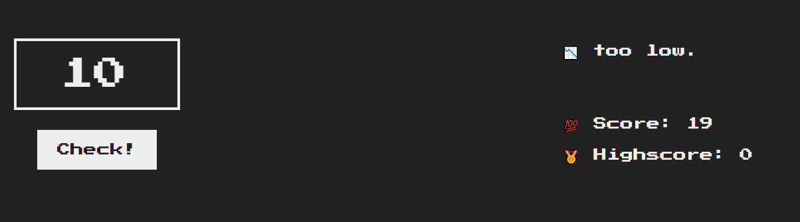

3. too high

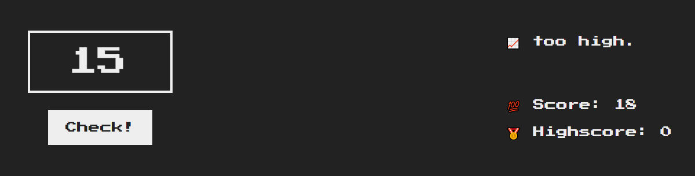

4. correct

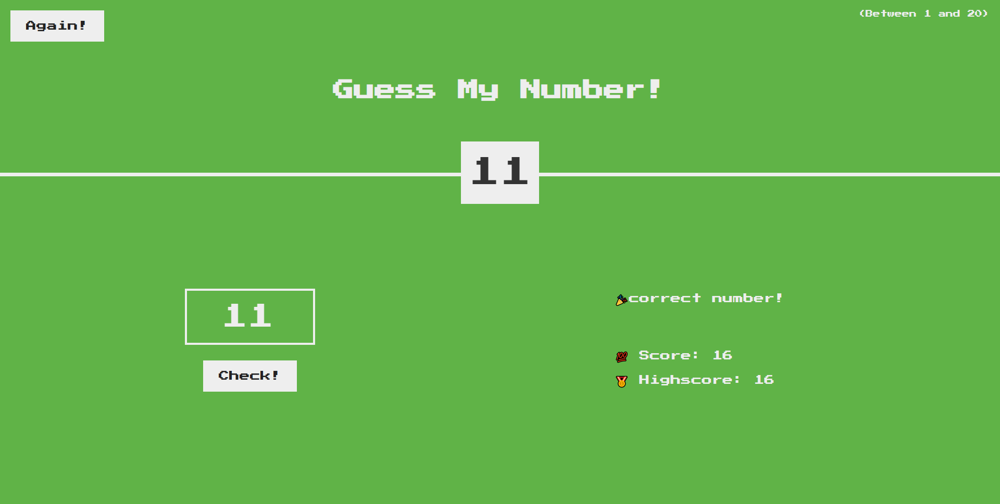

5. again

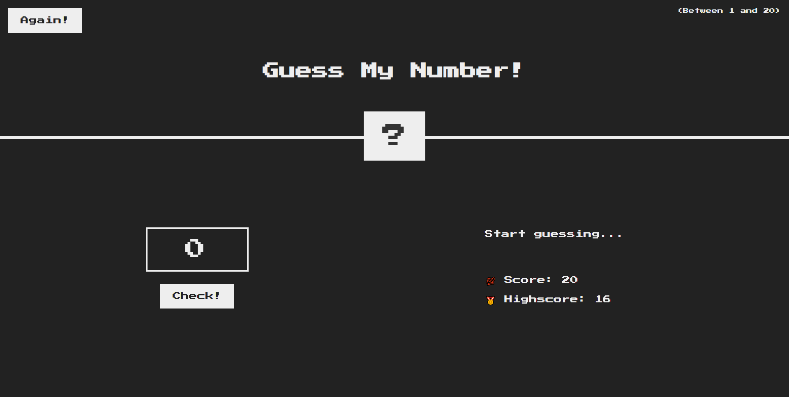

代码如下:

```js
// 设置正确数字
let number = Math.trunc(Math.random()*20 + 1);
console.log("number: ",number);

// check 设置事件监听器，类型为点击事件
document.querySelector(".check").addEventListener("click",function(){
    let guess = document.querySelector(".guess");        // 猜测值    
    let score = document.querySelector(".score");        // 得分
    let message = document.querySelector(".message");    // 提示信息
    let Topnumber = document.querySelector(".number");    // 顶部数字
    let highscore = document.querySelector(".highscore");    // 最高得分
    let check = document.querySelector(".check");        // 猜测按钮

    if(!guess.value) {
    // 未输入数字，设置提示信息
        message.textContent = "😓 no Number."
    }else{
        if (Number(guess.value) > number) {
        // 猜测数字过大
            score.textContent = Number(score.textContent) - 1;
            message.textContent = "📈 too high.";
        } else if (Number(guess.value) < number) {
        // 猜测数字过小
            score.textContent = Number(score.textContent) - 1;
            message.textContent = "📉 too low.";
        } else {
        // 正确情况
        // 设置提示信息
        // 判断最高分数
        // 设置顶部数字
        // 禁用猜测按钮
        // 设置body颜色
            message.textContent = "🎉correct number!";
            if (highscore.textContent === "0") {
                highscore.textContent = score.textContent;
            } else if (highscore.textContent < score.textContent)
                highscore.textContent = score.textContent;
            Topnumber.textContent = guess.value;
            check.disabled = true;
            document.body.style.backgroundColor = "#60b347";
        }
    }
})

// again 设置事件监听器，类型为点击事件
document.querySelector(".again").addEventListener("click",function(){
    // 重新获得正确数字
    number = Math.trunc(Math.random()*20 + 1);
    console.log(number);
    // 重置得分、提示消息、猜测数字、顶部数字、body背景颜色
    document.querySelector(".score").textContent = 20;
    document.querySelector(".message").textContent = "Start guessing...";
    document.querySelector(".check").disabled = false;
    document.querySelector(".guess").value = "";
    document.querySelector(".number").textContent = "?";
    document.body.style.backgroundColor = "#222";
})
```

> Tips:
> 
> 1. 可以继续实现得分为0时的失败信息
> 
> 2. 实现代码重构，将冗余的代码通过函数方法进行调用

---

### 项目二：模态框

内容：实现一个模态框

具体实现:

1. 按钮触发遮盖层、模态框的显现

2. 模态框的按钮触发隐藏遮盖层、模态框的显现

3. 监听事件（遮盖层、模态框按钮、`ESC`）触发显现事件

#### 页面截图:

1. 开始页面

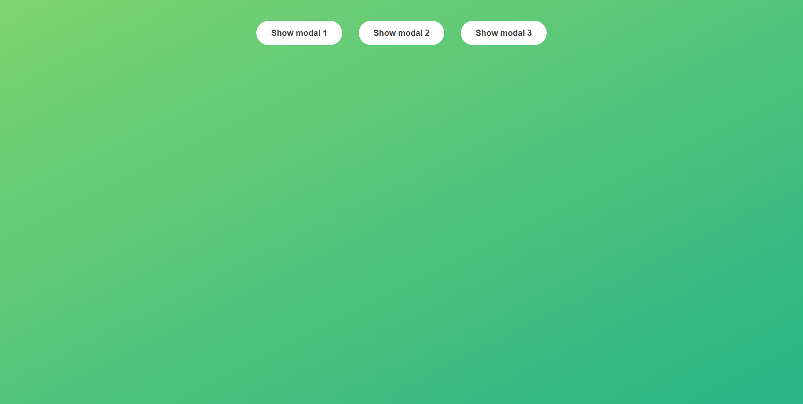

1. 模态框

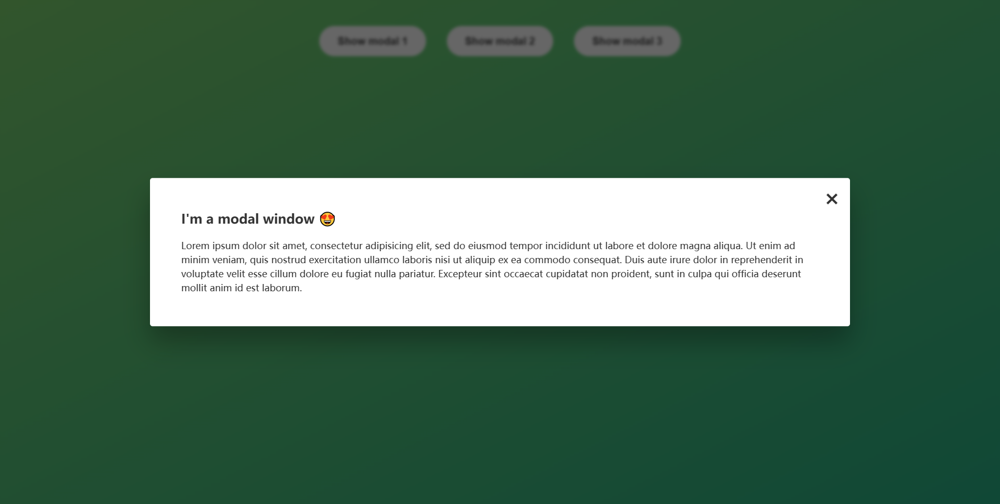

代码如下:

```js
const modal = document.querySelector('.modal');    // 获取模态框
const overlay = document.querySelector('.overlay'); // 获取遮盖层
const btnCloseModal = document.querySelector('.close-modal');    // 关闭模态框
const btnsOpenModal = document.querySelectorAll('.show-modal');    // 开启模态框

const clickOpenListener = function () {
    // modal.classList.remove("hidden","...")  删除多个类选择器语法
    // 打开模态框、遮盖层
    modal.classList.remove("hidden");
    overlay.classList.remove("hidden");
}

const clickCloseListener = function () {
    // 关闭模态框、遮盖层
    modal.classList.add("hidden");
    overlay.classList.add("hidden");
}

for (let i = 0; i < btnsOpenModal.length; i++) {
    // 按钮数组添加监听事件，打开模态框
    btnsOpenModal[i].addEventListener("click", clickOpenListener);
}

// 模态框按钮添加监听事件，关闭模态框
btnCloseModal.addEventListener("click", clickCloseListener);
// 遮盖层按钮添加监听事件，关闭模态框
overlay.addEventListener("click", clickCloseListener);
// 键盘添加监听事件，关闭模态框
document.addEventListener("keydown", function (event) {
    if (event.key === "Escape" && !modal.classList.contains("hidden")) clickCloseListener();
});
```

---

### 项目三：掷色子

#### 内容：

实现一个页面，分配两名玩家，分别掷色子，掷出2-6点统计为本轮的总得分，掷出1点则切换为另一位玩家，且本轮总得分记为0，通过`hold`按钮将本轮得分记为总得分，总得分超过10分则获胜，未超过则切换为另一位玩家，同时本轮总得分记为0，点击`reset`按钮开启下一轮游戏。

#### 实现截图:

1. 开始游戏

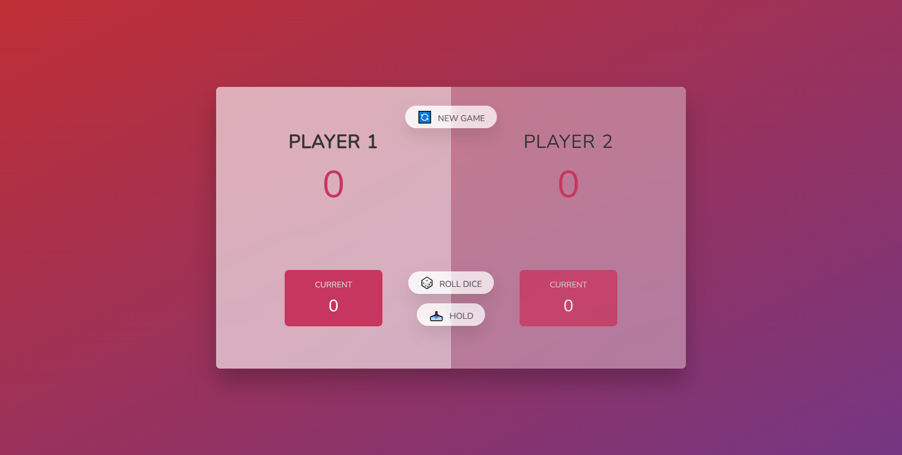

2. 掷色子

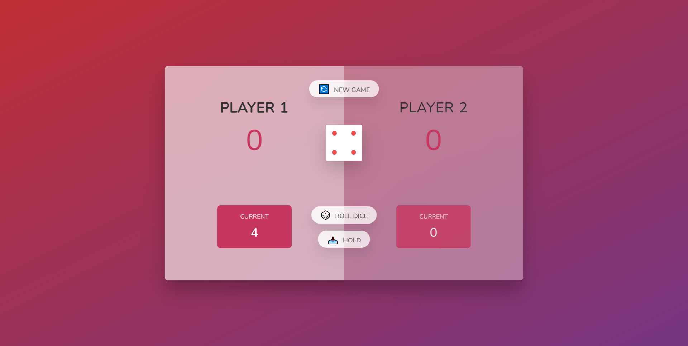

3. 获取得分

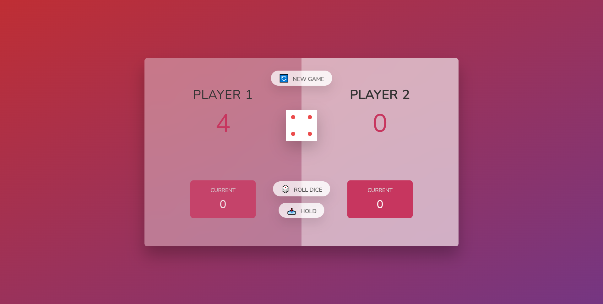

4. 获胜者

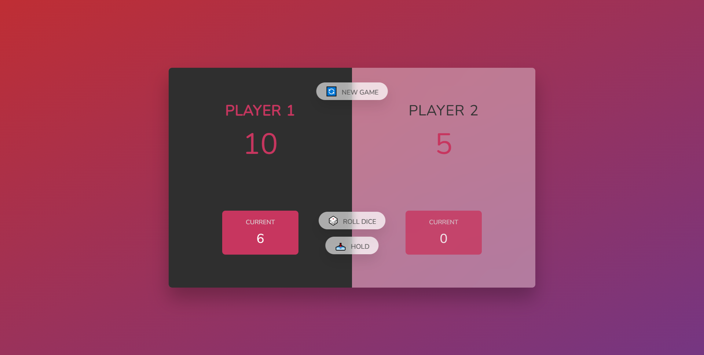

5. 重新开始


#### 实现代码

```js
const score0 = document.querySelector("#score--0");    // 记录玩家0的总得分
const score1 = document.getElementById("score--1");    // 记录玩家1的总得分
const currentScore0 = document.getElementById("current--0");    // 记录玩家0的当前得分
const currentScore1 = document.getElementById("current--1");    // 记录玩家1的当前得分

const dice = document.querySelector(".dice");    // 记录色子
const buttonRoll = document.querySelector(".btn--roll");    // 扔色子按钮
const buttonNew = document.querySelector(".btn--new");    // 重新开始按钮
const buttonHold = document.querySelector(".btn--hold");    // 提交得分按钮

const players = document.querySelectorAll(".player");    // 获取玩家板块数组
let switchIndex = false;    // 切换激活的玩家

// 初始化，设置玩家得分为0，并隐藏中间的色子，当前得分为0
score0.textContent = 0;
score1.textContent = 0;
dice.classList.add("hidden");

let currentScore = 0;

// 切换激活者状态
const changeActive = function(){
    switchIndex?currentScore1.textContent = 0:currentScore0.textContent = 0;
    players[0].classList.toggle("player--active");
    players[1].classList.toggle("player--active");
    switchIndex=!switchIndex;
    currentScore = 0;
}

// 检测总得分是否超过10，确定获胜者
const inspectChampion = function(index){
    if(Number(document.querySelector(`#score--${index}`).textContent)>=10) {
        players[index].classList.add("player--winner");
        buttonRoll.disabled = true;
        buttonHold.disabled = true;
        dice.classList.add("hidden");
    }else{
        changeActive();
    }
}

// 监听掷色子按钮，事件为点击，随机获取一个点数，并进行判断
buttonRoll.addEventListener("click", function () {
    const randomRoll = Math.trunc(Math.random() * 6 + 1);

    dice.classList.remove("hidden");
    dice.src = `dice-${randomRoll}.png`;

    if(randomRoll !== 1){
        currentScore += randomRoll;
        // currentScore0.textContent = currentScore;
        switchIndex?currentScore1.textContent = currentScore:currentScore0.textContent = currentScore;
    }else{
        changeActive()
    }
})

// 监听提交按钮，事件为点击，当前得分记为总得分，并进行获胜者判断
buttonHold.addEventListener("click",function () {
    if (players[0].classList.contains("player--active")){
        score0.textContent = Number(score0.textContent) + currentScore;
        inspectChampion(0);
    }else{
        score1.textContent = Number(score1.textContent)+currentScore;
        inspectChampion(1);
    }
})

// 监听重置按钮，事件为点击，重新开始游戏
buttonNew.addEventListener("click",function(){
    for (let i = 0; i < players.length; i++) {
        document.querySelector(`#score--${i}`).textContent = 0;
        document.querySelector(`#current--${i}`).textContent = 0;
        players[i].classList.remove("player--winner");
    }
    buttonRoll.disabled = false;
    buttonHold.disabled = false;
    players[0].classList.add("player--active");
    players[1].classList.remove("player--active");
    switchIndex = false;
    currentScore = 0;
})
```

---

#### 收获总结

```js
// 获取DOM对象
let test1 = document.querySelector(".类名 #id名");
let test2 = document.querySelectorAll(".类名 #id名");    //返回数组
let test3 = document.getElementById("id名");

// DOM对象操作
test1.classList    // 获取类列表
test1.classList.add()
test1.classList.remove()
test1.classList.toggle()
test1.classList.contain()


// 事件监听，一般用于按钮
// 事件类型: 鼠标事件||焦点事件||键盘事件||文本事件
button.addEventListener("事件类型",function(){
    // 触发函数
})
```

---

## 第4章 JS背后的原理

#### 1. 特性介绍

1. 高级编程语言

2. 垃圾回收机制

3. 解释型、即时编译

4. 多范式

> 当前流行的三种多范式:
> 
> - 程序化
> 
> - 面向对象
> 
> - 函数式编程

5. 原型对象、属性与方法继承

6. 函数对象

7. 动态性，动态分配数据类型

8. 非阻塞事件循环

#### 2. 具体内容

**1. JavaScript引擎**

运行javaScript的机制，由栈和堆组成

栈是执行代码的位置

堆是非结构化的内存池，存储对象

执行过程：

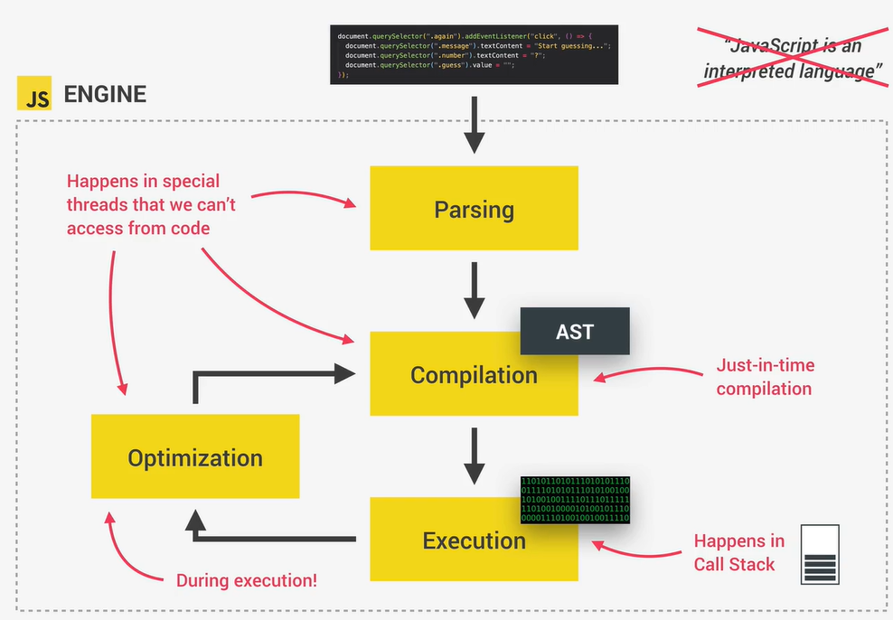

    前置内容

- 编译型执行过程：源代码编译为可执行文件，再执行该文件

- 解释型执行过程：源代码边翻译边执行

- 即时编译型执行过程：源代码边翻译边执行，保存多次执行的代码编译结果，以及对变量类型进行合理推测，降低代码平均执行时间，底层原理为**概率**

    执行内容

- 解析，生成AST树，将js代码结构化

- 编译，使用AST树，编译为机器语言

- 执行，运行机器语言，调用堆栈进行执行

- 优化`Optimization`，优化机器语言，使js能够更快执行

    执行图:

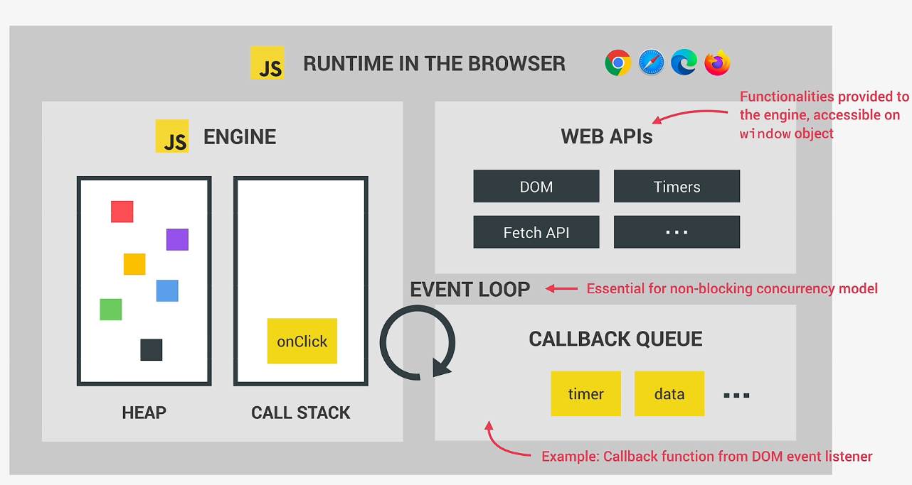

> ## 总结
> 
> JavaScript 运行速度的提升离不开 JIT compiler 的贡献，通过对**多次执行的代码的编译结果的存储，以及对变量类型的合理推测**，尽管存在运行时间加长的可能，但还是整体降低了 JavaScript 代码的平均执行时间。
> 
> 这对我们写 JavaScript 有什么帮助呢，其实帮助不大，只是说提醒我们保持一个很好的习惯就是不要随意修改一个变量的类型。
> 
> **真正震撼到我的点，不是了解了 JIT 是怎么工作的，而是 JIT 的原理竟然是 “概率”**
> 
> 从架构层面来讲，其实我们做任何性能优化，都要先问下目标是是平均值，还是极值。我相信大多数时候需要优化的指标都是平均值，那平均值比极值多出来一个维度那就是概率分布。对 100% 场景下的 1 秒优化可能远远比对 80% 场景下的 3s 优化还要难的多，但是收益却是后者高。
> 
> 从代码层面来说，我们大多数时候写代码结果都是 100% 确定的，如果有一定概率产生不一样的结果，那叫 bug。但如果你加快了 90% 情况下的执行速度，同时出了 10% 概率的 "bug"，并且 catch 了 这 10% 的错误做了额外的处理，最后的整体表现说不定会更好。
> 
> 这种思维方式的引入说不定会碰出不一样的火花
> 
> *借鉴于乃乎 from zhihu*

    **JS运行时**

主要包括四个部分，JS引擎、WEB APIs、回调队列、事件循环（`event loop`）

- js引擎负责存储对象、执行代码

- WEB APIs负责为js引擎提供DOM对象、Timer对象等等的内置方法，不属于js的内容

- 回调队列负责存储所有准备执行的回调函数，例如监听事件下点击触发的函数

- 事件循环负责把回调队列里的函数放入js引擎的栈中进行执行

    实例图如下:

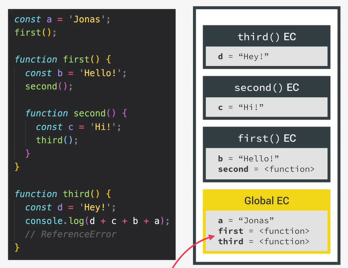

> Node.js 与 浏览器运行时js的区别
> 
>     Node.js不存在Web APIs，它拥有c++ bindings 与 线程池

    **2. 深入执行过程**

- 创建变量对象（Variable Object）：JavaScript引擎会创建一个变量对象，用于存储当前执行上下文中的变量、函数声明和形参等信息。

- 建立作用域链（Scope Chain）：JavaScript引擎会建立一个作用域链，用于解析变量和函数的作用域。

- 确定this指向：JavaScript引擎会确定当前执行上下文中的this指向。

- 执行代码：JavaScript引擎会执行当前执行上下文中的代码，包括变量赋值、函数调用、条件语句、循环语句等。

- 返回执行结果：JavaScript引擎会返回执行结果，如果是函数调用，则将返回值存储在调用栈中，等待下一次执行。

> javascript 只有一个执行线程
> 
> - 生成唯一的一个全局上下文对象
> 
> - 按顺序逐一实现局部上下文对象

从代码中获取全局对象，并存入栈中，若存在对象的为返回值，则需要进入函数进行执行，最终将值赋给该对象。

其中需要执行的函数就压入栈中并进行执行

执行的函数如果出现嵌套，那么就层层压入栈中

示例图：

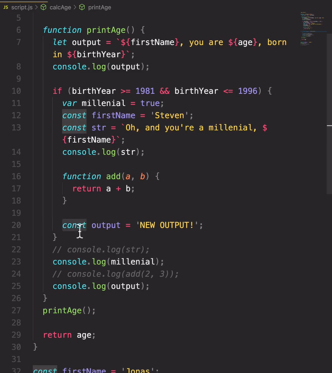

#### 3.作用域与作用域链

作用域分为：全局作用域、函数作用域、块作用域(ES6)

块作用域指`for`、`if`等包括的作用域

**作用域访问原则：内部作用域可以访问外部作用域**

`var`变量声明不适用于块作用域，`let,const`适用

注意点：

1. 避免在不同作用域下声明同名变量

2. 避免在块作用域下声明函数

3. 编码逻辑规划有序，避免杂乱不堪

4. 开启严格模式

避免出现下列示例：

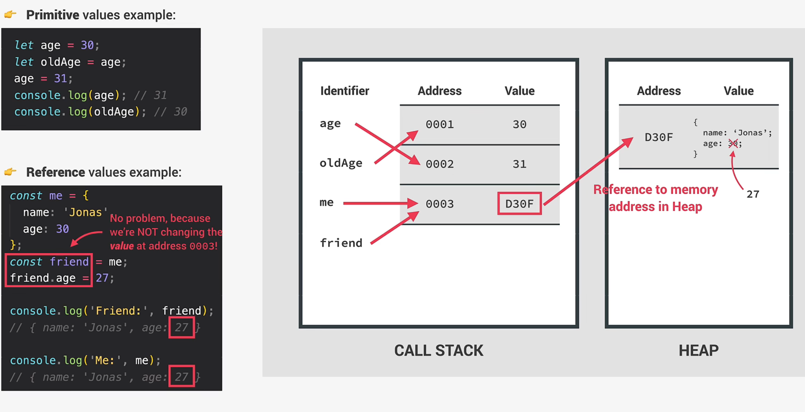

#### 4.变量提升

说明：使变量在未声明之前进行引用，并得到正确的效果

| Name       | 变量提升 | 未声明值      | 范围                 |
| ---------- | ---- | --------- | ------------------ |
| 函数声明       | 可实现  | 整个函数      | 块作用域(strice mode)  |
| var        | 可实现  | undefined | 函数作用域              |
| let，const  | 不可实现 | 产生错误      | 块作用域               |
| 函数表达式，箭头函数 | -    | -         | 由var 或 let,const决定 |

补充：

1. 函数形式

```js
// 函数声明
function add1(){

}
// 函数表达式
const add2 = function(){

}
// 箭头函数
const add3 = () => {

}
```

2. var变量

在被定义之后，在浏览器中，会被保存在`window`对象中

#### 5.this关键字

内容：在当前作用域下，对自己的引用。

示例：

```js
// 函数
function calcAge(birthYear){
    console.log(this);    // undefined
}
const calcAge1 = function(birthYear){
    console.log(this);    // undefined
}
const calcAge2 = (birthYear) => {
    console.log(this);    // window对象
}

// 对象
const Bobby = {
    year:1991,
    calcAge:function(){
        console.log(this);    // Bobby对象
    }
}
```

#### 6.常规函数与箭头函数

- 箭头函数的`this`指向`window`对象
- 在对象中，嵌套的常规函数，只有**第一层的函数**能够拿到对象的引用

示例代码:

```js
const object3 = {
    name: "Bob",
    getChar1:function(){
        console.log(`getChar1: `,this);

        function getChar2(){
            console.log(`getChar2: `,this);

            function getChar3(){
                console.log(`getChar3: `,this);
            }
            getChar3();
        }
        getChar2();
    }
}
object3.getChar1();

// getChar1:  {name: 'Bob', getName: ƒ, getChar1: ƒ}
// getChar2:  undefined
// getChar3:  undefined
```

- `arguments`关键字，获取到传入函数的所有参数

常规函数可以使用，而箭头函数无法使用

#### 7.原始类型与引用类型

回顾：

原始类型有`string`,`number`,`boolean`,`undefined`,`null`,`symbol`,`bigint`

引用类型有`function`,`array`,`object`等等

- 原始类型

数据会存放在栈中

变量名指向物理地址

物理地址保存数值

**多个变量名同时指向一个地址时，若当前变量名修改值，会生成一个新的存储地址**

- 引用类型

数据会存放在堆中，数据引用存放在栈中

变量名指向栈中的物理地址

栈中的物理地址保存堆引用

**多个变量名共享同一个堆栈**

说明图如下：

#### 8.实践

代码如下:

```js
// practice
// 实现原始类型拷贝
let lastName = `Williams`;
let oldLastName = lastName;
oldLastName = `Davis`;

console.log(lastName, oldLastName);

// 实现引用类型拷贝引用
const personList = {
    firstName:`Bob`,
    lastName:`Tom`,
    age:23
}

const personList2 = personList;
personList2.firstName = `Jerry`;
console.log(`personList`,personList);// {firstName: 'Jerry', lastName: 'Tom', age: 23}
console.log(`personList2`,personList2);// {firstName: 'Jerry', lastName: 'Tom', age: 23}

// 实现引用类型深拷贝第一层数据
const personList3 = Object.assign({},personList2);  // Object.assign 方法仅适用于第一层深拷贝
personList3.firstName = `mayor`;
console.log(`personList2`,personList2);// {firstName: 'Jerry', lastName: 'Tom', age: 23}
console.log(`personList3`,personList3);// {firstName: 'mayor', lastName: 'Tom', age: 23}
```

---

## 第5章 数组、对象和迭代方法，ES6以及String方法

#### 1. 数组解构

内容如下:

```js
// 过去的解构方式
const arr = [1, 2, 3];
const a1 = arr[0];
const a2 = arr[1];
const a3 = arr[2];
console.log(`a1, a2, a3: `, a1, a2, a3);

// ES6的解构方式
const [x, y, z] = arr;
console.log(`x,y,z: `, x, y, z);
console.log(arr);

// 跳过不需要解构的内容
let [first, , third] = restaurant.categories;
console.log(first, third);

// 数据替换
[first, third] = [third, first];
console.log(first, third);

// order方法返回两个值的数组
const [starter, mainCource] = restaurant.order(2, 0);
console.log([starter, mainCource]);

// 深度解构
const nested = [1,2,[4,5]];
// const [i,,j] = nested;
// console.log(i,j);
const [i ,, [j,k]] = nested;
console.log(i,j,k);

// 默认值与改变默认值
const [q,w,e,r=1] = [1,2,3];
console.log(q,w,e,r);// 默认值为 undefined
```

#### 2.对象解构

内容如下:

```js
// 一般的对象解构
const {name,openingHours,categories} = restaurant;
console.log(name,openingHours,categories);

// 解构对象，并重命名
const {
    name:hotelName,
    openingHours:hotelOpeningHouse,
    categories:hotelCategories
} = restaurant
console.log(hotelName,hotelOpeningHouse,hotelCategories);

// 解构对象，并赋默认值
const {
    menu = [],
    starterMenu = []
} = restaurant
console.log(menu,starterMenu);

// 解构对象，实现变量赋值
let a = 12;
let b = 13;
const obj = {a:111,b:222};
({a,b}=obj);
console.log(a,b);

// 深度解构对象
const {
    fri:{
        open:o,
        close:cl
    }
} = openingHours;

console.log(o,cl);

// 传入对象
restaurant.orderDelivery({
    time:`10:22`,
    address:`China`,
    mainIndex:2,
    starterIndex:1
})

// 传入对象，并在函数参数中进行解构
restaurant.orderDelivery2({
    time:`10:22`,
    address:`China`,
    mainIndex:2,
    starterIndex:1
})
```

#### 3.扩展运算符

内容如下:

```js
// 一般的数组赋值方式
const array = [2, 5, 7];
const arr = [1, 3, array[0], array[1], array[2]];

console.log(arr);

// 使用扩展运算符
const arr2 = [1, 3, ...array];

console.log(arr2);
console.log(...arr2);

const newMenu = [...restaurant.mainMenu,`Gnni c`];

console.log(newMenu);

// 使用扩展运算符，实现深拷贝
const newMenuCopy = [...newMenu];
newMenuCopy[0] = `waterMelon`;

console.log(newMenuCopy);

// 数组合并
const joinArray = [...restaurant.starterMenu,...restaurant.mainMenu];

console.log(joinArray);

// 字符串使用扩展运算符
const name = `JoJoby`;
const strArray = [...name,` `,`S.`];

console.log(strArray);

// 浏览器输入数据，使用扩展运算符
const details = [
    prompt(`Let's make a pizza,Ingredients 1?`),
    prompt(`Ingredients 2?`),
    prompt(`Ingredients 3?`),
]

console.log(details);
console.log(...details);

restaurant.orderPasta(details[0],details[1],details[2]);
restaurant.orderPasta(...details);

// 对象使用扩展运算符
const objectRest = {founded:1999,base:`ChongQing`,...restaurant};

console.log(objectRest);

// 扩展运算符实现对象的深拷贝
const objectRestCopy = {...objectRest};
objectRestCopy.base = `YaLaSuo`;

console.log(objectRestCopy.base);
console.log(objectRest.base);
```

#### 4.扩展运算符打包

内容如下:

```js
// 使用扩展运算符
const arr = [1,2,...[4,5,6]];

// 扩展运算符打包
const [a,b,...other] = arr;

console.log(a,b,other);

// 打包
const [pizza,risotto,...otherFood] = [...restaurant.mainMenu,...restaurant.starterMenu];

console.log(pizza,risotto,otherFood);

// 对象打包
const {sat,...weekdays} = restaurant.openingHours;

console.log(sat,weekdays);

// 函数参数打包
function printWeather(...weather){
    console.log(weather);
}
printWeather(1,2,3,4,5);

// 对象内置函数参数打包
restaurant.orderPizza(`apple`,`banana`,`cripple`,`drinking`,`ease`,`flower`,`group`);
```

#### 5.and,or运算符

介绍：

1. and运算符`&&`:判断域里找假值，找到就返回该假值，未找到就返回最后一个真值。

2. or运算符`||`:判断域里找真值，找到就返回该真值，未找到就返回最后一个假值。

代码如下:

```js
console.log(3 || `Bob`);  // 3
console.log('' || 'Bob');  // Bob
console.log(true || 0);  // true
console.log(undefined || null);  // null
console.log(undefined || 0 || '' || 'Hello' || 23 || null);  // Hello

// restaurant.numGuests = 25
const guests1 = restaurant.numGuests ? restaurant.numGuests : 10;
console.log(guests1);  // 25

const guests2 = restaurant.numGuests ||  10;
console.log(guests2);  // 25

console.log(`---AND---`);

console.log(0 && 'Bob');  // 0
console.log(7 && 'Bob');  // Bob
console.log('Hello' && 23 && null && 'Bob');  // null

if(restaurant.orderPizza){  // function
    restaurant.orderPizza('mushrooms','spinach');
}
// function && function()
restaurant.orderPizza && restaurant.orderPizza('mushrooms','spinach');
```

#### 6.空值合并运算符

```js
let a = 5;
console.log(a || 10); // 5
console.log(a ?? 10); // 5

console.log(`a=0`);

a = 0;
console.log(a || 10); // 10
console.log(a ?? 10); // 0
```

#### 7.运算符赋值

```js
const rest1 = {
    name:'Bob',
    numGuests:12
}

const rest2 = {
    name:'FireFox',
    owner:'Grooyy'
}

// rest1.numGuests = rest1.numGuests || 10;
// rest2.numGuests = rest2.numGuests || 10;
// rest1.numGuests ||= 10;  // 找到第一个真值，并赋值
// rest2.numGuests ||= 10;

// rest1.numGuests ??= 10;  // 问对象本身有没有值，没有值就赋值
// rest2.numGuests ??= 10;

rest1.owner &&= '<Apple>';  // 找到最后一个真值，并赋值
rest2.owner &&= '<Apple>';

console.log(rest1);
console.log(rest2);
```

#### 挑战一 足球比赛

```js
// Coding Challenge #1

/*
We're building a football betting app (soccer for my American friends 😅)!

Suppose we get data from a web service about a certain game (below). In this challenge we're gonna work with the data. So here are your tasks:

1. Create one player array for each team (variables 'players1' and 'players2')
2. The first player in any player array is the goalkeeper and the others are field players. For Bayern Munich (team 1) create one variable ('gk') with the goalkeeper's name, and one array ('fieldPlayers') with all the remaining 10 field players
3. Create an array 'allPlayers' containing all players of both teams (22 players)
4. During the game, Bayern Munich (team 1) used 3 substitute players. So create a new array ('players1Final') containing all the original team1 players plus 'Thiago', 'Coutinho' and 'Perisic'
5. Based on the game.odds object, create one variable for each odd (called 'team1', 'draw' and 'team2')
6. Write a function ('printGoals') that receives an arbitrary number of player names (NOT an array) and prints each of them to the console, along with the number of goals that were scored in total (number of player names passed in)
7. The team with the lower odd is more likely to win. Print to the console which team is more likely to win, WITHOUT using an if/else statement or the ternary operator.

TEST DATA FOR 6: Use players 'Davies', 'Muller', 'Lewandowski' and 'Kimmich'. Then, call the function again with players from game.scored

GOOD LUCK 😀
*/
const game = {
    team1: 'Bayern Munich',
    team2: 'Borrussia Dortmund',
    players: [
        [
            'Neuer',
            'Pavard',
            'Martinez',
            'Alaba',
            'Davies',
            'Kimmich',
            'Goretzka',
            'Coman',
            'Muller',
            'Gnarby',
            'Lewandowski',
        ],
        [
            'Burki',
            'Schulz',
            'Hummels',
            'Akanji',
            'Hakimi',
            'Weigl',
            'Witsel',
            'Hazard',
            'Brandt',
            'Sancho',
            'Gotze',
        ],
    ],
    score: '4:0',
    scored: ['Lewandowski', 'Gnarby', 'Lewandowski', 'Hummels'],
    date: 'Nov 9th, 2037',
    odds: {
        team1: 1.33,
        x: 3.25,
        team2: 6.5,
    },
};


// 完成解构
const [player1,player2] = game.players;
console.log(player1,player2);

// 数组解构
const [goalKeeper,...fieldPlayers] = player1;
console.log(goalKeeper,fieldPlayers);

// 数组合并
const allPlayers = [...player1,...player2];
console.log(allPlayers);

// 数组合并2
const players1Final = [...player1,...['Thiago', 'Coutinho', 'Perisic']];
console.log(players1Final);

// 数组深度解构并重命名
const {odds:{team1,x:draw,team2}} = game;
console.log(team1,draw,team2);

// 函数参数解构
function printGoals(...players){
    console.log(`${players.length} goals are scored.`);
}

printGoals(...game.scored);

// 逻辑且判断为真，则执行最后一句语言
team1 < team2 && console.log(`team1 will be more likely to win.`);
team1 > team2 && console.log(`team2 will be more likely to win.`);
```

---

#### 8.循环结构(for of)

本意：更加方便的获取到数组的每一个元素

代码如下:

```js
const menu = [...restaurant.starterMenu, ...restaurant.mainMenu];

// 数组迭代
for (const item of menu) {
    console.log(item);
}

// 数组迭代，并生成下标
for (const item of menu.entries()) {
    console.log(item);
}

// 数组迭代，生成下标，并解构获取
for( const [index,item] of menu.entries()){
    console.log(`${index}: ${item}`);
}
```

#### 9.增强模板文字

- 声明与赋值可以用声明变量名进行表达`{name}`

- 对象中的函数可以不用可以表达`funtion`

- 子对象可以使用数组符号进行赋值`[array[0]]:{}`

示例如下:

```js
const name = {
    man: ['Bob', 'Jack'],
    woman: ['Jassiy', 'Mooly']
}

const time = [10, 12, 18];

const object = {
    name,
    getName() {
        console.log(...this.name.man);
        console.log(...this.name.woman);
    },
    thing: {
        [time[0]]: {
            job: 'writter',
            money: 12
        },
        [time[1]]: {
            job: 'painter',
            money: 5
        },
        [time[2]]: {
            job: 'guard',
            money: 24
        },
        [`job-${time[2]}`]: {
            job: 'sleep',
            money: 500
        },
    }
}

console.log(object);
object.getName();
```

#### 10.可选链运算符(?.)

作用: 用于判断符号后的内容是否存在，若存在则返回，若不存在则返回`undefined`

内容如下:

```js
// 对象的链式判断
console.log(restaurant.openingHours.mon?.open);
console.log(restaurant.openingHours?.fri?.open);

// 搭配循环进行链式判断
const days = ['mon','wen','thu','tur','fri','sat','sun'];
for (const day of days){
    const open = restaurant.openingHours[day]?.open ?? 'closed';
    console.log(`at ${day},we open at ${open}`);
}

// 函数的链式判断，结合空值合并运算符
console.log(restaurant.order?.(0,1) ?? 'Method is not found.');
console.log(restaurant.ordered?.(0,1) ?? 'Method is not found.');

// 数组对象进行链式判断
const person = [{
    name:'Bob',
    email:'email@qq.com'
}]

console.log(person[0]?.name ?? 'have not the name.');

if (person.length !== 0){
    console.log(person[0].name);
}else{
    console.log('not the name.')
}
```

#### 11.获取键名、键值，生成键值对数组，以及应用

```js
// 生成键名
const properties = Object.keys(restaurant.openingHours);
console.log(properties);

let openStr = `We can open on ${properties.length} days:`;
for(const day of properties){
    openStr += `${day}, `;
}
console.log(openStr);

// 生成键值
const values = Object.values(restaurant.openingHours);
console.log(values);

// 生成键值对数组
const entries = Object.entries(restaurant.openingHours);
console.log(entries);

// 键值对应用
for (const [key,{open,close}] of entries){
    console.log(`On ${key}, we can open at ${open},and close at ${close}`);
```

#### 挑战二 足球比赛2

```js
///////////////////////////////////////
// Coding Challenge #2

/*
Let's continue with our football betting app!

1. Loop over the game.scored array and print each player name to the console, along with the goal number (Example: "Goal 1: Lewandowski")
2. Use a loop to calculate the average odd and log it to the console (We already studied how to calculate averages, you can go check if you don't remember)
3. Print the 3 odds to the console, but in a nice formatted way, exaclty like this:
      Odd of victory Bayern Munich: 1.33
      Odd of draw: 3.25
      Odd of victory Borrussia Dortmund: 6.5
Get the team names directly from the game object, don't hardcode them (except for "draw"). HINT: Note how the odds and the game objects have the same property names 😉

BONUS: Create an object called 'scorers' which contains the names of the players who scored as properties, and the number of goals as the value. In this game, it will look like this:
      {
        Gnarby: 1,
        Hummels: 1,
        Lewandowski: 2
      }

GOOD LUCK 😀
*/

const loopScored = Object.entries(game.scored);
// console.log(loopScored);
for(const [key,value] of loopScored){
    console.log(`Goal ${key}: ${value}`);
}

const valueOdds = Object.values(game.odds);
// console.log(valueOdds);
let sum = 0;
for(const value of valueOdds){
    sum += value;
}
console.log(`average is : `,sum/valueOdds.length);

const loopOdds = Object.entries(game.odds);
console.log(loopOdds);
for(const [name,value] of loopOdds){
    console.log(`Odd of ${name !== 'x'?`Victory ${game[name]}`:`draw`}: ${value}`);
} //数组计数，并生成计数数组

const valueScored = Object.values(game.scored);
console.log(valueScored);

const scorers = {};
for(const value of valueScored){
    scorers[value] = scorers[value] ? scorers[value]+1 : 1;
} // 实现对象生成与赋值
console.log(scorers);
```

#### 12. Set集合

ES6之后诞生的一种数据结构，用于存放独一无二的数据。

内容:

1. 接收`string`数据、`array`数据

2. 在`set`集合中，会去掉相同的值，使数据以独一无二的形式呈现

3. 支持循环迭代、解构

4. `set`集合集成`has,add,delete,size`等等方法

示例如下:

```js
// 生成set集合
const set = new Set(['Bob','Jimmy','Jack','Jimmy','Jack']);

console.log(set);
console.log(new Set('LeBea'));

console.log(set.size);
// 判断值是否存在
console.log(set.has('Jimmy'));
console.log(set.has('Quiede'));

// 添加与删除
set.add('Quiede');
set.add('James');
set.delete('James');

console.log(set);

// 循环迭代
for(const name of set) console.log(name);

// 解构为新数组
const staff = ['Waiter','Chef','Manager','Waiter','Chef','Waiter','Chef'];
const staffUnique = [...new Set(staff)];
console.log(staffUnique);
console.log(new Set(staff).size);
console.log(new Set('ashyuajhgzykqw').size);
```

#### 13.Map集合

ES6之后诞生的一种数据结构，用于存储键值对。

内容:

1. 接受任何数据类型，包括`document,array`

2. 通过键名获取键值

示例如下:

```js
// 生成map结构
const rest = new Map();
rest.set('name', 'Lex Sium');
rest.set(1, 'China,Xi\'an');
rest.set(2, 'GuiAn,Province');
console.log(rest);

// 添加键值对
rest.set('categories', ['American', 'France', 'Japan', 'Korean']).set('open', 11).set('close', 23).
set(true, 'open at :D').set(false, 'closed at :(');

// 获取键值
console.log(rest.get('name'));
console.log(rest.get(true));
console.log(rest.get(1));

const time = 8;
console.log(rest.get(time > rest.get('open') && time < rest.get('close')));

console.log(rest.has('categories'));
// rest.delete(2);
// rest.clear();

// 特别说明，直接设置数组会导致set,get方法里的请求键名数组不相同，
// 主要原因是 set,get方法申请的数组空间不相同，尽管数据相同
// 所以 切记使用变量名引用对应的数据空间
let arr = [1,2]
rest.set(arr,'Array[]:1,2');
console.log(rest.get(arr));

// 设置document对象键名
rest.set(document.querySelector('h1'),'Title');
console.log(rest.get(document.querySelector('h1')));

console.log(rest);
console.log(rest.size);
```

#### 14. Map集合应用

代码如下:

```js
// 定义Map集合
const question = new Map([
    ['question','who is the best player in NBA?'],
    [1,'LBJ'],
    [2,'MJ'],
    [3,'JB'],
    [4,'Tom Duncan'],
    ['correct',3],
    [true,'Correct!❤'],
    [false,'Try Again!'],
]);
console.log(question);

// 对象生成键值对，再转为Map集合
console.log(Object.entries(restaurant.openingHours));
const hoursMap = new Map(Object.entries(restaurant.openingHours));

console.log(hoursMap);

// 应用
console.log(question.get('question'));
for(const [key,value] of question){
    if(typeof key === 'number') console.log(`Answer ${key}: ${value}`);
}

const answer = 3;

// 判断答案一
if(answer === question.get('correct')){
    console.log(question.get(true));
}else{
    console.log(question.get(false))
}
// 判断答案二 巧妙
console.log(question.get(answer === question.get('correct')));

// 将Map集合转换为数组
console.log([...question]);
// 获取键名、键值
console.log(question.keys());
console.log(question.values());
```

#### 14.array,object,set,map总结

(1) `array,object`:普通的数据结构，用于存放数据，可以完成增删改查、排序等等操作

(2) `set`: 存放独一无二的值，**解析数组**有大用处

(2) `map`:存放键值对的数据结构，**需要通过键值对来描述行为**的时候使用

#### 挑战三 足球比赛3

```js
///////////////////////////////////////
// Coding Challenge #3

/*
Let's continue with our football betting app! This time, we have a map with a log of the events that happened during the game. The values are the events themselves, and the keys are the minutes in which each event happened (a football game has 90 minutes plus some extra time).

1. Create an array 'events' of the different game events that happened (no duplicates)
2. After the game has finished, is was found that the yellow card from minute 64 was unfair. So remove this event from the game events log.
3. Print the following string to the console: "An event happened, on average, every 9 minutes" (keep in mind that a game has 90 minutes)
4. Loop over the events and log them to the console, marking whether it's in the first half or second half (after 45 min) of the game, like this:
      [FIRST HALF] 17: ⚽️ GOAL

GOOD LUCK 😀
*/

const gameEvents = new Map([
    [17, '⚽️ GOAL'],
    [36, '🔁 Substitution'],
    [47, '⚽️ GOAL'],
    [61, '🔁 Substitution'],
    [64, '🔶 Yellow card'],
    [69, '🔴 Red card'],
    [70, '🔁 Substitution'],
    [72, '🔁 Substitution'],
    [76, '⚽️ GOAL'],
    [80, '⚽️ GOAL'],
    [92, '🔶 Yellow card'],
]);


const event = [...new Set(gameEvents.values())];
console.log(event);

gameEvents.delete(64);
console.log(gameEvents);

const time = [...gameEvents.keys()].pop();
console.log(`An event happened, on average, every ${time / gameEvents.size} minutes`);

for(const[key,value] of gameEvents){
    console.log(`${key<45?'[FIRST HALF]':'[SECOND HAFL]'} ${key}: ${value}`);
}
```

#### 15. String 类型的方法

方法如下:

1. `length`:获取长度

2. `String[0]`:获取对应位置的字符

3. `indexOf()`:查询字符串第一次出现的位置，找不到返回-1

4. `lastIndexOf()`:查询该字符串出现的最后一次位置，找不到返回-1

5. `slice(a,[b])`:截取字符串，起始位置a，截至位置b，数字为负则从末尾开始查找

> 实例: `console.log(ariLine.slice(0,-2));` // plane = 'A320'; 得到A3

6. `toUpperCase()`:将字符串改为大写

7. `toLowerCase()`:将字符串改为小写

8. `trim()`:去除字符串前后的空格

9. `replace('Butler','Bruce')`:找到第一个`Butler`，并将其替换为`Bruce`

10. `replaceAll('Butler','Bruce')`:将找到的所有`Butler`，并将其替换为`Bruce`

11. `includes('abc')`:判断字符串是否包括`abc`

12. `startsWith('abc')`:判断字符串是否以`abc`开头

13. `endsWith('abc')`:判断字符串是否以`abc`结尾

14. `split('-')`:将字符串以`-`号分割为数组

15. `join('+')`:将数组以`+`号合成为字符串

16. `padStart(20,'💕')`:将字符串长度改为20，剩余的前置空间添加💕

17. `padEnd(20,'💕')`:将字符串长度改为20，剩余的后置空间添加💕

#### 挑战四 字符串规范

```js
///////////////////////////////////////
// Coding Challenge #4

/*
Write a program that receives a list of variable names written in underscore_case and convert them to camelCase.

The input will come from a textarea inserted into the DOM (see code below), and conversion will happen when the button is pressed.

THIS TEST DATA (pasted to textarea)
underscore_case
 first_name
Some_Variable
  calculate_AGE
delayed_departure

SHOULD PRODUCE THIS OUTPUT (5 separate console.log outputs)
underscoreCase      ✅
firstName           ✅✅
someVariable        ✅✅✅
calculateAge        ✅✅✅✅
delayedDeparture    ✅✅✅✅✅

HINT 1: Remember which character defines a new line in the textarea 😉
HINT 2: The solution only needs to work for a variable made out of 2 words, like a_b
HINT 3: Start without worrying about the ✅. Tackle that only after you have the variable name conversion working 😉
HINT 4: This challenge is difficult on purpose, so start watching the solution in case you're stuck. Then pause and continue!

Afterwards, test with your own test data!

GOOD LUCK 😀
*/
document.body.append(document.createElement('textarea'));
document.body.append(document.createElement('button'));
const changeButton = document.querySelector('button');

const camelCase = function(stringWords){
    const stringWordArray = stringWords.split("\n");
    const resultArray = [];

    for(const [index,item] of stringWordArray.entries()){
        let [first,second] = item.trim().toLowerCase().split('_');
        let result = first + second[0].toUpperCase() + second.slice(1);
        // resultArray.push(result.padEnd(20,' ')+'✔'.repeat(index+1));
        resultArray.push(`${result.padEnd(20,' ')}${'✔'.repeat(index+1)}`);
    }

    return resultArray.join('\n')
}

changeButton.addEventListener('click',function(){
    const text = document.querySelector('textarea').value;
    document.querySelector('textarea').value = camelCase(text);
})
```

#### 练习 机场字符串格式化

```js
///////////////////////////////////////
// String Methods Practice

const flights =
    '_Delayed_Departure;fao93766109;txl2133758440;11:25+_Arrival;bru0943384722;fao93766109;11:45+_Delayed_Arrival;hel7439299980;fao93766109;12:05+_Departure;fao93766109;lis2323639855;12:30';

// 🔴 Delayed Departure from FAO to TXL (11h25)
//              Arrival from BRU to FAO (11h45)
//   🔴 Delayed Arrival from HEL to FAO (12h05)
//            Departure from FAO to LIS (12h30)

const getUpper = str => str.slice(0,3).toUpperCase();

for(const flight of flights.split('+')){
    const [type,from,to,time] = flight.split(';');
    const result = `${type.startsWith('_Delayed')?'🔴':''}${type.replaceAll('_',' ')} from ${getUpper(from)} ${getUpper(to)} (${time.replace(':','h')})`.padStart(42,' ');
    console.log(result);
}
```

---

## 第6章 函数

#### 1.函数传参

重点：对于默认参数的设置

```js
const bookings = [];

const createBooking = function(flightNumber,passengersNumber = 1,price = 998 * passengersNumber){
    // ES5 的默认参数赋值方法
    // passengersNumber = passengersNumber ?? 1;
    // price = price ?? 998;

    const booking = {
        flightNumber,
        passengersNumber,
        price
    }

    console.log(booking);
    bookings.push(booking);
}

createBooking('NF883');
createBooking('NF883',2,199);
createBooking('NF883',5,299);
createBooking('NF883',6);
createBooking('NF883',undefined,668);
```

#### 2.原始数据与引用数据的变化

内容：传递进入函数中的**原始数据**、**引用数据**在函数中发生二次赋值，**原始数据**不会发生改变，而**引用数据**的内部属性会发生改变

示例：

```js
const flight = `NF556`;
const Bob = {
    name:'Bob Jerry',
    passport:77882211
};

const checkIn = function(flightNum, passenger){
    flightNum = 'NF999'; // 原始数据发生改变
    passenger.name = 'Mr. '+ passenger.name; // 对象数据发生改变

    if (passenger.passport === 77882211){
        console.log(`alert in`);
    }else{
        console.log(`Wrong passport!`);
    }
}

checkIn(flight,Bob);
console.log(flight); // NF556
console.log(Bob); // {name: 'Mr. Bob Jerry', passport: 77882211}
```

#### 3. 函数的多种应用简介

- 变量、对象存储函数

- 函数作为变量应用于其它函数

- 函数返回一个函数

- 回调函数

#### 4. 函数形参

```js
// 去除字符串之间空格
const oneWord = function(string){
    return string.replaceAll(' ','').toLowerCase();
}
// 将首个单词大写
const upperFirstWord = function(string){
    const [first,...others] = string.split(' ');
    return [first.toUpperCase(),...others].join(' ');
}
// 接收函数形参
const transformer = function(str,fn){
    console.log(`Original string: ${str}`);
    console.log(`Transformed string: ${fn(str)}`);
    console.log(`Transformed by: ${fn.name}`);
}
// 调用高阶函数，并传入函数，！！注意并没有在此进行调用
transformer(`JavaScript is the best!`,upperFirstWord);
transformer(`JavaScript is the best!`,oneWord);

// 函数绑定到页面元素上进行使用
const high5 = function (){
    console.log(`😊`);
}

document.body.addEventListener('click',high5);
['Bob','Tom','Jerry','Ding'].forEach(high5);
```

#### 5. 调用内部函数

```js
// 定义内部函数
const greet = function (greeting) {
    return function (name) {
        console.log(`${greeting} ${name} 😊`);
    }
}

// 传递主函数，获得内部函数
const greeterHey = greet('Hey');
greeterHey('David');
greeterHey('Evi');

// 直接调用内部函数
greet('Hello')('Bob');

// 内部函数为箭头函数
const greet2 = function (greeting) {
    return (name) => {
        console.log(`${greeting} ${name} 😊`);
    }
}

greet2('Haloooo')('Tom');

// 全箭头函数
const greet3 = greeting => name => console.log(`${greeting} ${name} 😊`);

greet3('Hayoo')('Jerry');
```

#### 6. call与apply

```js
const lufthansa = {
    airline:'Lufthansa',
    iataCode:'LH',
    bookings:[],
    book(flightNum,name){
        console.log(`${name} booked a seat on ${this.airline} flight ${this.iataCode}${flightNum}`);
        this.bookings.push({flight:`${this.iataCode}${flightNum}`,name})
    }
}

lufthansa.book(239,`Bob Tom`);
lufthansa.book(336,`Jim Lorry`);

const eurowings = {
    name:'Eurowings',
    iataCode: 'EW',
    bookings:[]
}

const book = lufthansa.book;
book.call(eurowings,23,'Bob France'); // 使用call调用

const swiss = {
    airline:'Swiss Air Lines',
    iataCode:'LX',
    bookings:[],
}

book.call(swiss,583,'Bob England'); // 使用call调用
console.log(swiss);

const flightData = [583,'Bob England'];
book.apply(swiss,flightData); // 使用apply调用
console.log(swiss);

book.call(swiss,...flightData);  // apply，可以被call方法替代
console.log(swiss);
```

#### 7.bind方法

```js
const lufthansa = {
    airline: 'Lufthansa',
    iataCode: 'LH',
    bookings: [],
    book(flightNum, name) {
        console.log(`${name} booked a seat on ${this.airline} flight ${this.iataCode}${flightNum}`);
        this.bookings.push({flight: `${this.iataCode}${flightNum}`, name})
    }
}
const eurowings = {
    name: 'Eurowings',
    iataCode: 'EW',
    bookings: []
}
const swiss = {
    airline: 'Swiss Air Lines',
    iataCode: 'LX',
    bookings: [],
}

const book = lufthansa.book;

// bind方法，将函数绑定到指定对象上
const bookEW = book.bind(eurowings);
const bookLH = book.bind(lufthansa);
const bookLX = book.bind(swiss);

bookEW(23, 'Bob Tom');

// bind方法，将函数绑定到指定对象上，并传入部分参数
const bookEW23 = book.bind(eurowings, 224);
bookEW23('Bob Tom');
bookEW23('Bob Jerry');

lufthansa.planes = 300;
lufthansa.buyPlane = function () {
    console.log(this);

    this.planes++;
    console.log(this.planes);
}

// 将buyPlane方法绑定到lufthansad对象上
document.querySelector('.buy').
addEventListener('click', lufthansa.
buyPlane.bind(lufthansa));

const addTax = (rate, value) => value + value * rate;
console.log(addTax(0.1, 200));

// bind方法，不传递对象，传递rate参数
const addVAT = addTax.bind(null, 0.148);

console.log(addVAT(100));
console.log(addVAT(25));


const addRate = function (rate) {
    return function (value) {
        return rate * value + value
    }
}

// 获取内部函数，实现bind方法的效果
const addVAT2 = addRate(0.361);

console.log(addVAT2(100));
console.log(addVAT2(25));
```

#### 挑战一 函数调用

```js
// Coding Challenge #1

/*
Let's build a simple poll app!

A poll has a question, an array of options from which people can choose, and an array with the number of replies for each option. This data is stored in the starter object below.

Here are your tasks:

1. Create a method called 'registerNewAnswer' on the 'poll' object. The method does 2 things:
  1.1. Display a prompt window for the user to input the number of the selected option. The prompt should look like this:
        What is your favourite programming language?
        0: JavaScript
        1: Python
        2: Rust
        3: C++
        (Write option number)

  1.2. Based on the input number, update the answers array. For example, if the option is 3, increase the value AT POSITION 3 of the array by 1. Make sure to check if the input is a number and if the number makes sense (e.g answer 52 wouldn't make sense, right?)
2. Call this method whenever the user clicks the "Answer poll" button.
3. Create a method 'displayResults' which displays the poll results. The method takes a string as an input (called 'type'), which can be either 'string' or 'array'. If type is 'array', simply display the results array as it is, using console.log(). This should be the default option. If type is 'string', display a string like "Poll results are 13, 2, 4, 1".
4. Run the 'displayResults' method at the end of each 'registerNewAnswer' method call.

HINT: Use many of the tools you learned about in this and the last section 😉

BONUS: Use the 'displayResults' method to display the 2 arrays in the test data. Use both the 'array' and the 'string' option. Do NOT put the arrays in the poll object! So what shoud the this keyword look like in this situation?

BONUS TEST DATA 1: [5, 2, 3]
BONUS TEST DATA 2: [1, 5, 3, 9, 6, 1]

GOOD LUCK 😀
*/

const poll = {
    question: 'What is your favourite programming language?',
    options:['0: JavaScript','1: Python','2: Rust','3: C++'],
    answers:new Array(4).fill(0),
    registerNewAnswer(){
        let questions = `${this.question}\n${this.options.join('\n')}\n(Write option number)`;
        let anwser = Number(prompt(questions));

        typeof anwser && anwser <= this.answers.length && this.answers[anwser]++;

        this.displayResults();
        this.displayResults('array');
    },

    displayResults(type = 'string'){
        if(type === `string`){
            console.log(`Poll results are ${this.answers}`)
        }else if(type === `array`){
            console.log(this.answers);
        }
    }
}

document.querySelector('.poll').addEventListener('click',poll.registerNewAnswer.bind(poll));

poll.displayResults.call({answers:[5, 2, 3]},`string`);
poll.displayResults.call({answers:[1, 5, 3, 9, 6, 1]},`array`);
```

#### 8.IIFE(立即调用函数表达式)

内容：创建一个隐蔽的函数，执行期间不影响全局作用域

```js
const runOnce = function(){
    console.log(`the function is never run again`);
}
runOnce();

(function(){  // 立即执行函数
    console.log(`the function is never run again`);
})();

(() => console.log(`the function is also never run again`))();  // 箭头函数示例

{  // 函数作用域
    let a = 1;
    var b = 2;
}

// console.log(a);
console.log(b);
```

#### 9.闭包

概念：

封闭变量执行上下文的环境，在其中创建了函数，可以使用环境中的变量。

特点：

1. 隐蔽函数变量

2. 开放内部函数

3. 内部函数使用函数作用域里的变量

示例代码:

```js
const guest = function(){
    let people = 0;
    return function(){
        people++;
        console.log(`Now ${people} are here.`);
    }
}

const addGuest = guest();

addGuest();
addGuest();
addGuest();

console.dir(addGuest);
```

示例图:

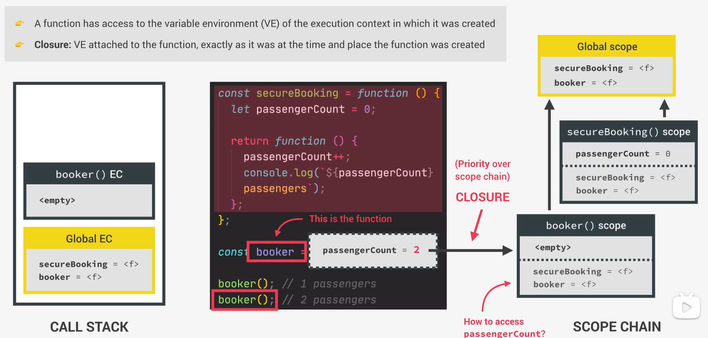

练习代码如下:

```js
const guest = function(){
    let people = 0;
    return function(){
        people++;
        console.log(`Now ${people} are here.`);
    }
}

const addGuest = guest();

addGuest();
addGuest();
addGuest();

console.dir(addGuest); 


let bbj;

const gFunc = function(){
    let a = 5;
    bbj = function (){
        console.log(`a: `,a**2);
    }
}

const bFunc = function (){
    let b = 9;
    bbj = function (){
        console.log(`b: `,b**2);
    }
}

gFunc();
bbj();

bFunc();
bbj();

const board = function(n,wait){
    const perGroup = n / 3;

    setTimeout(()=>{
        console.log(`We are now boarding all ${n} passengers.`);
        console.log(`There are 3 groups, each with ${perGroup} passengers.`);
    },1000*wait);

    console.log(`Will start boarding in ${wait} seconds`);
}
```

总结：

**通过创建内部作用域，与外部词法环境产生连接的结果**

#### 挑战2 闭包

```js
///////////////////////////////////////
// Coding Challenge #2 
// 实现标题随机变换颜色

/!*
This is more of a thinking challenge than a coding challenge 🤓

Take the IIFE below and at the end of the function, attach an event listener that changes the color of the selected h1 element ('header') to blue, each time the BODY element is clicked. Do NOT select the h1 element again!

And now explain to YOURSELF (or someone around you) WHY this worked! Take all the time you need. Think about WHEN exactly the callback function is executed, and what that means for the variables involved in this example.

GOOD LUCK 😀
*!/

(function(){
    const colorString = `0123456789abcdef`;
    const header = document.querySelector('h1');
    document.querySelector('body').addEventListener('click',function(){
        let result = '';
        for(let i=0;i<6;i++) result += colorString[Math.trunc(Math.random()*colorString.length -1)]
        header.style.color = `#${result}`;
    })
})();
```

---

## 第7章 数组

#### 1. 数组方法

方法总结:

| 方法名     | 方法作用            | 补充                           |
| ------- | --------------- | ---------------------------- |
| slice   | 截取子字符串          |                              |
| splice  | 截取子字符串，修改源字符串   |                              |
| reverse | 反转字符串，修改源字符串    |                              |
| concat  | 组合两个字符串         | 可以使用`[...arr1,...arr2]`进行替代  |
| join    | 数组转换为字符串，接收间隔字符 |                              |
| at      | 返回索引位置的值        | 使用`-1`可以直接获取末尾的位置            |
| forEach | 使用回调函数，遍历整个数组   | 无法终止遍历过程；`map,set`集合也可以使用该方法 |

代码如下:

```js
let arr = ['a','b','c','d','e','f','g'];

console.log(arr.slice(2));
console.log(arr.slice(2,4));
console.log(arr.slice(-2));
console.log(arr.slice(2,-2));
console.log(arr.slice());
console.log([...arr]);

// console.log(arr.splice(1,3));
// console.log(arr);

// console.log(arr.splice(-2));
// console.log(arr);

// console.log(arr.splice(3,-2));
// console.log(arr);

// console.log(arr.reverse());
// console.log(arr);

let arr2 = ['z','x','c','v'];

console.log(arr.concat(arr2));
console.log([...arr,...arr2]);
console.log(arr);

let arrCon = [...arr,...arr2];
console.log(arrCon.join('-')); 


let arr2 = ['z','x','c','v'];

console.log(arr.concat(arr2));
console.log([...arr,...arr2]);
console.log(arr);

console.log(arrCon[1]);
console.log(arrCon.at(1));
console.log(arrCon[arrCon.length - 1]);
console.log(arrCon.at(-1));
console.log('abdcc'.at(2));
console.log('abdcc'.at(-2));
```

#### 挑战一 数组

```js
///////////////////////////////////////
// Coding Challenge #1

/*
Julia and Kate are doing a study on dogs. So each of them asked 5 dog owners about their dog's age, and stored the data into an array (one array for each). For now, they are just interested in knowing whether a dog is an adult or a puppy. A dog is an adult if it is at least 3 years old, and it's a puppy if it's less than 3 years old.

Create a function 'checkDogs', which accepts 2 arrays of dog's ages ('dogsJulia' and 'dogsKate'), and does the following things:

1. Julia found out that the owners of the FIRST and the LAST TWO dogs actually have cats, not dogs! So create a shallow copy of Julia's array, and remove the cat ages from that copied array (because it's a bad practice to mutate function parameters)
2. Create an array with both Julia's (corrected) and Kate's data
3. For each remaining dog, log to the console whether it's an adult ("Dog number 1 is an adult, and is 5 years old") or a puppy ("Dog number 2 is still a puppy 🐶")
4. Run the function for both test datasets

HINT: Use tools from all lectures in this section so far 😉

TEST DATA 1: Julia's data [3, 5, 2, 12, 7], Kate's data [4, 1, 15, 8, 3]
TEST DATA 2: Julia's data [9, 16, 6, 8, 3], Kate's data [10, 5, 6, 1, 4]

GOOD LUCK 😀
*/

const checkDogs = function (dogsJulia, dogsKate) {
    const copyDogsJulia = dogsJulia.slice(1, -2);
    console.log(copyDogsJulia);

    const DogsArray = [...copyDogsJulia, ...dogsKate];
    DogsArray.forEach(function (item, index) {
        if (item > 1) {
            console.log(`Dog number ${index} is an adult, and is ${item} years old`);
        } else {
            console.log(`Dog number ${index} is still a puppy 🐶`);
        }
    })
}

checkDogs([3, 5, 2, 12, 7], [4, 1, 15, 8, 3]);
checkDogs([9, 16, 6, 8, 3], [10, 5, 6, 1, 4]);
```

#### 2. map,filter,reduce

| 方法名    | 方法描述                                                | 补充                                    |
| ------ | --------------------------------------------------- | ------------------------------------- |
| map    | 使用回调函数，获取`item,index,array`内容，并返回新数组                |                                       |
| filter | 使用回调函数，获取`item,index,array`内容，并返回新数组                | 筛选符合条件的数据                             |
| reduce | 使用回调函数，获取`accumulate,current,index,array`内容，并返回最终结果 | `accumulate`记录累计值<br>`current`记录数组当前值 |

举例:

```js
const deposits = account1.movements.filter(function(item){
    return item>0;
})  
// 结果
// account1.movements [200, 450, -400, 3000, -650, -130, 70, 1300]
// deposits [200, 450, 3000, 70, 1300]


const result = account1.movements.reduce(function(accResult, current, index, array){
    console.log(`index ${index}: ${accResult} , current: ${current}`);
    return accResult+current;
},0)  
// 结果，显示其中一次执行及运行结果
// index 4: 3250 , current: -650
// 3840
```

#### 挑战二 狗狗的年龄

```js
///////////////////////////////////////
// Coding Challenge #2

/*
Let's go back to Julia and Kate's study about dogs. This time, they want to convert dog ages to human ages and calculate the average age of the dogs in their study.

Create a function 'calcAverageHumanAge', which accepts an arrays of dog's ages ('ages'), and does the following things in order:

1. Calculate the dog age in human years using the following formula: if the dog is <= 2 years old, humanAge = 2 * dogAge. If the dog is > 2 years old, humanAge = 16 + dogAge * 4.
2. Exclude all dogs that are less than 18 human years old (which is the same as keeping dogs that are at least 18 years old)
3. Calculate the average human age of all adult dogs (you should already know from other challenges how we calculate averages 😉)
4. Run the function for both test datasets

TEST DATA 1: [5, 2, 4, 1, 15, 8, 3]
TEST DATA 2: [16, 6, 10, 5, 6, 1, 4]

GOOD LUCK 😀
*/

const calcAverageHumanAge = function (ageArray) {

    /* version 1
    let humanAgeArray = ageArray.map((item)=>{
        if(item<=2){
            // console.log(2 * item);
            return 2 * item;
        }else{
            // console.log(16 + item * 4);
            return 16 + item * 4;
        }
    })
    console.log('humanAgeArray',humanAgeArray);

    let filterArray = humanAgeArray.filter(item=>item>=18);
    console.log('filterArray',filterArray);

    let average = filterArray.reduce((acc,current,_,arr)=>{
        return acc+current/arr.length;
    },0);
    console.log('average',average);*/

    let humanAgeArray = ageArray.map((item) => item <= 2 ? item * 2 : 4 * item + 16);
    console.log('humanAgeArray', humanAgeArray);

    let filterArray = humanAgeArray.filter(item => item >= 18);
    console.log('filterArray', filterArray);

    let average = filterArray.reduce((acc, current, _, arr) => {
        return acc + current / arr.length;
    }, 0);
    console.log('average', average);
}

calcAverageHumanAge([5, 2, 4, 1, 15, 8, 3]);
calcAverageHumanAge([16, 6, 10, 5, 6, 1, 4]);
```

#### 挑战三 狗狗的年龄 链式实现

```js
///////////////////////////////////////
// Coding Challenge #3

/*
Rewrite the 'calcAverageHumanAge' function from the previous challenge, but this time as an arrow function, and using chaining!

TEST DATA 1: [5, 2, 4, 1, 15, 8, 3]
TEST DATA 2: [16, 6, 10, 5, 6, 1, 4]

GOOD LUCK 😀
*/
const calcAverageHumanAge = ageArray => ageArray
        .map(item => item <= 2 ? item * 2 : 4 * item + 16)
        .filter(item => item >= 18)
        .reduce((acc, current, _, arr) =>  acc + current / arr.length, 0);

let aver1 = calcAverageHumanAge([5, 2, 4, 1, 15, 8, 3]);
let aver2 = calcAverageHumanAge([16, 6, 10, 5, 6, 1, 4]);

console.log(aver1,aver2);
```

#### 3.find,findIndex,some,every,flap

| 方法名         | 方法描述                                                                     | 补充     |
| ----------- | ------------------------------------------------------------------------ | ------ |
| find        | 使用回调函数，获取`item,index,array`内容，并返回**符合条件的第一个数据**                          |        |
| findIndex   | 使用回调函数，获取`item,index,array`内容，并返回**符合条件的第一个数据的索引下标**                     |        |
| some        | 使用回调函数，获取`item,index,array`内容，并返回**布尔值结果**，至少有一个元素满足条件，返回`true`          |        |
| every       | 使用回调函数，获取`item,index,array`内容，并返回**布尔值结果**，每一个元素满足条件，返回`true`            |        |
| flap()      | 将数组中的子数组解构，使得数据完全存在于一个数组中，接收**数字**，表示解构子数组得深度，默认为1                       | ES2021 |
| new Array() | 生成数组，接收数组、单个数字，获取数组生成数组对象；获取数字生成**数字长度、内容为空**的数组                         |        |
| fill()      | 接收三个参数，`value,start,end`三个数值，其中`end`可选，表示空数组填充`value`，从`start`开始，`end`结束 |        |
| Array.from  | 生成数组，并**可**执行回调函数，操纵数值                                                   |        |

示例:

```js
// flat
const arr = [1, 2, 3, [4, 5], 6];
console.log(arr.flat()) 
// result: [1, 2, 3, 4, 5, 6]

const arr2 = [1, [2, 3], [4, 5], 6, [7, [8, 9]]];
console.log(arr2.flat(2))
// result: [1, 2, 3, 4, 5, 6, 7, 8, 9]  


// Array.from  
const y = Array.from({length: 7}, () => 2);
console.log(y);  // [2, 2, 2, 2, 2, 2, 2]

const z = Array.from({length: 7}, (_, i) => i + 1);
console.log(z);  // [1, 2, 3, 4, 5, 6, 7]

labelBalance.addEventListener('click', function () {
    const movementsUI = Array.from(document.querySelectorAll('.movements__value'),el => el.textContent.replace('€','').trim());
    console.log(movementsUI);

    const movementsUI2 = [...document.querySelectorAll('.movements__value')].map(item => item.textContent.replace('€','').trim());
    console.log(movementsUI2);
    // ['1300', '70', '-130', '-650', '3000', '-400', '450', '200']
});
```

#### 4. 总结数组方法

| 方法        | 方法内容  | 备注            |
| --------- | ----- | ------------- |
| push      | 插入元素  |               |
| unshift   |       |               |
| pop       | 删除元素  |               |
| shift     |       |               |
| splice    | 截取子数组 |               |
| reverse   | 翻转    |               |
| sort      | 排序    |               |
| fill      | 填充    | ----改变原元素     |
| map       | 遍历    |               |
| filter    | 过滤    |               |
| slice     | 截取子元素 |               |
| concat    | 拼接数组  |               |
| flat      | 平整化数组 |               |
| flatMap   |       | ----生成新数组     |
| indexOf   |       |               |
| findIndex |       |               |
| find      |       | ----返回元素下标    |
| includes  |       |               |
| some      |       |               |
| every     |       |               |
| join      |       | ----判断数组、拼接数组 |
| reduce    |       |               |
| forEach   |       | ----遍历数组元素    |

---

## 第8章 数字与时间

#### 1. 数字对象(Number)

| 方法         | 方法内容                            | 补充  |
| ---------- | ------------------------------- | --- |
| parseInt   | 一般接收两个参数，`内容，进制`，用于将内容转化为对应进制   |     |
| parseFloat | 一般接收一个参数，`内容`，用于将内容转化为对应数字，保留小数 |     |
| isNaN      | 判断一个内容是否**不是数字**                |     |
| isFinite   | 判断一个内容是否**是有限的**                |     |

#### 2. 数学对象(Math)

| 方法      | 方法内容                                  | 补充  |
| ------- | ------------------------------------- | --- |
| sqrt    | 实现数学中的开根号                             |     |
| max     | 从一众数字中选出最大值，示例`Math.max(2,3,4,6) //6` |     |
| min     | 从一众数字中选出最小值                           |     |
| PI      | 代表数字里的`Π`符号（圆周率）                      |     |
| random  | 初始会提供0-1之间的所有数字，通过乘法扩展范围              |     |
| trunc   | 将数字的小数部分去除                            |     |
| round   | 对数字进行四舍五入                             |     |
| ceil    | 对数字进行向上取整                             |     |
| floor   | 对数字进行向下取整                             |     |
| toFixed | 保留数字的小数位，示例`(2.7).toFixed(2) // 2.70` |     |

#### 3. 数字表达

| 符号名 | 符号     | 内容                                                  |
| --- | ------ | --------------------------------------------------- |
| 下划线 | __     | 使用在数字之间，不影响表达结果，例如：`22_33`，使用在数字对象中，表达结果是NaN        |
| 大整型 | bigInt | 使用方法：`3486576934238978n`，`BigInt(3486576934238978)` |

#### 4. 日期对象

创建方式：`new Date()`

对象方法：

1. getFullYear()，获取对象年份

2. getMonth()，获取对象月份

3. getDate()，获取对象日期

4. getDay()，获取对象当日为一周中的第几天

5. getHours()，获取对象小时

6. getMinutes()，获取对象分钟

7. getSeconds()，获取对象分秒

8. toISOString()，返回一个ISO格式的时间

9. getTime()，获取当前时间对象的时间戳表达，从1970年1月1日开始计算

10. now()，获取当前时间的时间戳表达

11. setFullYear()，设置当前日期对象的年份

#### 5. 国际化

国际化日期（Intl.DateTimeFormat）

内容：通过确定地区，将日期对象格式化为当地日期的表达形式

代码如下

```js
const now = new Date();
let dDate = new Intl.DateTimeFormat('en-US').format(now); 
```

国际化数字（Intl.NumberFormat）

示例如下

```js
const num = 2736672.773;
console.log('US:     ',new Intl.NumberFormat('en-US').format(num));
console.log('Germany:',new Intl.NumberFormat('de-DE').format(num));
```

#### 6. 延时函数

| 方法名  | 方法表达式                            | 内容                  |
| ---- | -------------------------------- | ------------------- |
| 延时触发 | setTimeOut(function,time,[...])  | 到指定时间后，触发函数，并结束延时函数 |
| 连续触发 | setInterval(function,time,[...]) | 到指定时间后，触发函数         |
| 清除延时 | clearTimerOut()                  | 参数内添加延时对象           |
| 清除连续 | clearInterval()                  | 参数内添加连续对象           |

---

## 第9章 高级DOM

#### 9.1 DOM

DOM对象是一棵结点树，管理着所有的标签对象

结点的类型有：元素、文本、接口、文本符号（comment）、网页（document）

#### 9.2 DOM方法

| 方法名                    | 方法内容                    | 补充    |
| ---------------------- | ----------------------- | ----- |
| .documentElement       | 获取DOM文档结点               |       |
| .head                  | 获取头结点                   |       |
| .body                  | 获取body结点                |       |
| .querySelector         | 查找到第一个符合条件的结点           |       |
| .querySelectorAll      | 查找到所有符合条件的结点，并返回列表      |       |
| .getElementById        | ID查找器                   |       |
| .getElementByTagName   | 标签查找器                   |       |
| .getElementBuClassName | 类查找器                    | 查找    |
| .insertAdjcentHtml     | 创建元素                    |       |
| .createElement         | 创建元素                    |       |
| .classList.add         | 为结点元素添加类名               |       |
| .textContent           | 为结点元素添加纯文本内容            |       |
| .innerHTML             | 为结点元素添加文本、标签内容          |       |
| .prepend               | 在当前结点之前插入新元素，多次插入相同元素无效 |       |
| .append                | 在当前结点之后插入新元素，多次插入相同元素无效 |       |
| .cloneNode             | 复制节点，可以实现多次插入           |       |
| .before                | 在当前结点之前插入新元素            |       |
| .after                 | 在当前结点之后插入新元素            | 创建，添加 |
| .remove                | 删除当前结点                  |       |
| .removeChild           | 删除当前结点的子节点              |       |

#### 9.3 style,attributes,classes

style是文档对象上的样式对象

attributes是文档对象里的标签对象，标签对象上还有自定义的数据集**dataset**，提供只读数据

classes是文档对象里的类列表对象

| 方法名字                   | 方法内容                                                                                                                                                  | 补充         |
| ---------------------- | ----------------------------------------------------------------------------------------------------------------------------------------------------- | ---------- |
| .backgroundColor       | 背景颜色                                                                                                                                                  |            |
| .width                 | 宽度                                                                                                                                                    |            |
| .height                | 高度                                                                                                                                                    |            |
| .setProperty           | 设置属性，格式如：（属性名称，属性值），用于获取CSS上的属性，并将属性进行设置，JS：`document.documentElement.style.setProperty('--color-primary','#c04c4c')`，CSS：`--color-primary: #5ec576;` | style      |
| .alt                   | img图片的说明标签                                                                                                                                            |            |
| .src                   | img的链接地址                                                                                                                                              |            |
| .className             | 类名称                                                                                                                                                   |            |
| .getAttribute          | 获得标签对象上定义的属性值                                                                                                                                         |            |
| .setAttribute          | 为标签对象，设置属性，格式：（属性名，属性值）                                                                                                                               | attributes |
| .add                   | 添加                                                                                                                                                    |            |
| .remove                | 删除                                                                                                                                                    |            |
| .toggle                | 删除标记值，并返回false，不存在则添加标记值，并返回true                                                                                                                      |            |
| .contains              | 判断列表中是否包含该值                                                                                                                                           |            |
| childNodes             | 该元素下的所有结点                                                                                                                                             |            |
| children               | 该元素下的子结点                                                                                                                                              |            |
| firstElementChild      | 首位子结点                                                                                                                                                 |            |
| lastElementChild       | 尾位子结点                                                                                                                                                 |            |
| parentNode             | 父结点                                                                                                                                                   |            |
| parentElement          | 父元素                                                                                                                                                   |            |
| closest                | 查询该元素的上级结点                                                                                                                                            |            |
| previousElementSibling | 前一个兄弟元素                                                                                                                                               |            |
| nextElementSibling     | 后一个兄弟元素                                                                                                                                               |            |
| previousSibling        | 前一个兄弟结点                                                                                                                                               |            |
| nextSibling            | 后一个兄弟节点                                                                                                                                               |            |
| parentElement.children | 当前元素的父元素下的所有结点                                                                                                                                        | classes    |

#### 9.3 效果实现

1. **平滑滚动**

前置内容

| 方法名字                         | 方法内容                | 补充  |
| ---------------------------- | ------------------- | --- |
| getBoundingClientRect        | 返回当前对象的大小以及相对于视口的位置 |     |
| documentElement.clientHeight | 返回当前的视口高度           |     |
| documentElement.clientWidth  | 返回当前的视口宽度           |     |
| windw.pageXOffset            | 返回滚动条离X轴初始位置的距离     |     |
| windw.pageYOffset            | 返回滚动条离Y轴初始位置的距离     |     |

```js
const s1coords = section1.getBoundingClientRect();

// 滚动的实现，该元素离顶部的距离+滚动条离顶部的距离 = 指定元素的位置
window.scrollTo(
s1coords.left+window.pageXOffset,s1coords.top+window.pageYOffset
)


// 平滑滚动
window.scrollTo({
    left:s1coords.left + window.pageXOffset,
    top:s1coords.top + window.pageYOffset,
    behavior:'smooth'
  }) 

// 现代方法
section1.scrollIntoView({behavior:'smooth'})
```

2. **鼠标事件**

方法：

| 方法名字       | 方法内容      | 补充  |
| ---------- | --------- | --- |
| mouseenter | 鼠标移入元素时触发 |     |

添加监听事件

```js
const h1 = document.querySelector('h1');

// 监听事件触发后，删除监听事件
const alertH1 = function (e) {
  alert(`监听事件 mouseenter 触发`);

  h1.removeEventListener('mouseenter',alertH1);
}

h1.addEventListener('mouseenter',alertH1);
```

#### 9.4 冒泡、捕获、委托

监听事件的触发过程如下：

先捕获、再冒泡

- **捕获**：触发事件时，首先从根结点层层寻找，直到找到触发结点为止

- **冒泡**：找到触发结点之后，从当前结点开始，层层向上传递，直到根节点为止

- **委托**：监听事件绑定到父元素上，当子元素触发冒泡事件时，通过父元素实现监听事件触发

补充：当前元素再触发监听事件后，捕获完成之后，当前元素会被冒泡到外层元素的`event.target`对象上，可以通过`event.stopPropagation`阻止事件向上冒泡

```js
元素对象.addEventListener('click',function(e){
    // 监听体
},false) // 默认false，指冒泡阶段捕获事件，可调整为捕获阶段
```

> `preventDefault:监听事件如果未执行，那么该元素的默认事件不触发`

事件委托示例：

```js
document.querySelector('.nav__links').addEventListener('click',
function(e){
  e.preventDefault(); //阻止当前元素的默认事件触发

  if (e.target.classList.contains('nav__link')){
    const id = e.target.getAttribute('href');
    document.querySelector(id).scrollIntoView({behavior:'smooth'})
  }
})
```

#### 9.5 监听者对象

使用过程：

1. 创建`IntersectionObserver`对象

2. 配置回调函数、选项

3. 使用observe方法进行DOM元素监听

示例：

```js
// 获取DOM元素
const header = document.querySelector('.header');
// 获取当前视口下，Nav元素的高度
const navHeight = nav.getBoundingClientRect().height;
console.log(navHeight);
// 配置观察者对象的回调函数，参数还有一个 observer
const stickyNav = function(entries){
  const [entry] = entries;
  console.log(entry);
  if(!entry.isIntersecting) nav.classList.add('sticky')
  else nav.classList.remove('sticky')
}
// 创建监听者对象，并配置参数
const headerObserver = new IntersectionObserver(stickyNav,{
  root:null,
  threshold:0,// 交叉值
  rootMargin:`-${navHeight}px`// 监听者对象设置margin值，提前位置触发
})
headerObserver.observe(header) // 监听header对象
```

#### 9.6 Dom生命周期

1. HTML树读取完毕后触发

`document.addEventListener('DOMContentLoaded',function(e){})`

2. 页面读取完毕触发

`window.addEventListener('load',function(e){})`

3. 退出页面前触发

`window.addEventListener('beforeunload',function(e){})`

#### 9.7 script的执行方式、位置

| 方式名称                     | 头部             | 尾部             |
| ------------------------ | -------------- | -------------- |
| 常规执行                     | 先执行脚本，再遍历HTML树 | 先遍历HTML树，再执行脚本 |
| 异步执行`<script async ...>` | 执行脚本，同时遍历HTML树 |                |
| 延迟执行`<script defer...>`  | 遍历HTML树        |                |

具体说明：

1. defer，这个布尔属性的设置是为了向浏览器表明，该脚本是要在文档被解析后，但在触发 `DOMContentLoaded`事件之前执行的。

2. async，对于普通脚本，如果存在 `async` 属性，那么普通脚本会被并行请求，并尽快解析和执行。
   
   对于[模块脚本](https://developer.mozilla.org/zh-CN/docs/Web/JavaScript/Guide/Modules)，如果存在 `async` 属性，那么脚本及其所有依赖都会在延缓队列中执行，因此它们会被并行请求，并尽快解析和执行。

#### 挑战

1. 实现监测导航

```js
const header = document.querySelector('.header');
const navHeight = nav.getBoundingClientRect().height;
console.log(navHeight);
const stickyNav = function (entries) {
    const [entry] = entries;
    // console.log(entry);
    if (!entry.isIntersecting) nav.classList.add('sticky')
    else nav.classList.remove('sticky')
}

const headerObserver = new IntersectionObserver(stickyNav, {
    root: null,
    threshold: 0,
    rootMargin: `-${navHeight}px`
})
headerObserver.observe(header)


// 界面模块监测
const allSections = document.querySelectorAll('.section');

const revealSection = function (entries, observer) {
    const [entry] = entries;
    // console.log(entry)
    if (!entry.isIntersecting) return;
    entry.target.classList.remove('section--hidden')
    observer.unobserve(entry.target)
}

const sectionObeserver = new IntersectionObserver(revealSection, {
    root: null,
    threshold: 0.15
});

allSections.forEach((section) => {
    sectionObeserver.observe(section);
    section.classList.add('section--hidden');
})
```

2. 图片懒加载

```js
const imgTargets = document.querySelectorAll('img[data-src]');

const loadImg = function (entries, observer) {
    const [entry] = entries;
    console.log(entry);

    if (!entry.isIntersecting) return;

    entry.target.src = entry.target.dataset.src;
    entry.target.addEventListener('load', function () {
        entry.target.classList.remove('lazy-img')
    })

    observer.unobserve(entry.target)
}

const imgObserver = new IntersectionObserver(loadImg, {
    root: null,
    threshold: 0
})
imgTargets.forEach((img) => imgObserver.observe(img))
```

3. 幻灯片

```js
const slides = document.querySelectorAll('.slide');
const btnLeft = document.querySelector('.slider__btn--left')
const btnRight = document.querySelector('.slider__btn--right')

const dotContainer = document.querySelector('.dots')
let curSlide = 0;
const maxSlide = slides.length;

// const slider = document.querySelector('.slider');
// slider.style.transform = 'scale(0.4) translateX(-800px)';
// slider.style.overflow = 'visible';

const createDots = function () {
    slides.forEach(function (_, i) {
        dotContainer.insertAdjacentHTML('beforeend', `
    <button class="dots__dot" data-slide="${i}"></button>
    `)
    })
}
createDots();

const activateDot = function (slide) {
    document
        .querySelectorAll('.dots__dot')
        .forEach(dot => dot.classList.remove('dots__dot--active'));
    document
        .querySelector(`.dots__dot[data-slide="${slide}"]`)
        .classList
        .add('dots__dot--active');
}
activateDot(0)

const goToSlide = function (slide) {
    slides.forEach((s, i) =>
        s.style.transform = `translateX(${100 * (i - slide)}%)`);
}

goToSlide(0);

const nextSlide = function () {
    if (curSlide === maxSlide - 1) {
        curSlide = 0;
    } else {
        curSlide++
    }
    goToSlide(curSlide)
    activateDot(curSlide)
}

const prevSlide = function () {
    if (curSlide === 0) {
        curSlide = maxSlide - 1;
    } else {
        curSlide--;
    }
    goToSlide(curSlide)
    activateDot(curSlide)
}

btnRight.addEventListener('click', nextSlide)
btnLeft.addEventListener('click', prevSlide)

document.addEventListener('keydown',function(e){
    if (e.key === 'ArrowLeft') prevSlide();
    e.key === 'ArrowRight' && nextSlide();
})
dotContainer.addEventListener('click',function (e) {
    if (e.target.classList.contains('dots__dot')){
        const {slide} = e.target.dataset;
        goToSlide(slide);
        activateDot(slide);
    }
})
```
