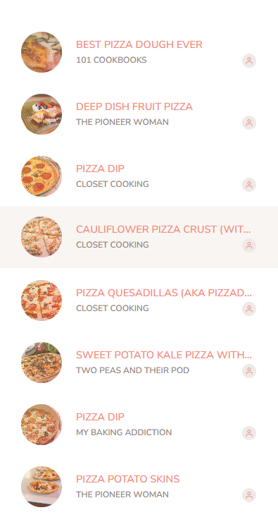
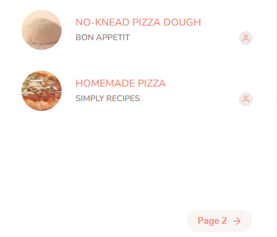
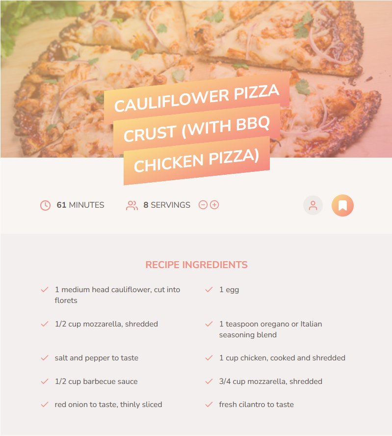
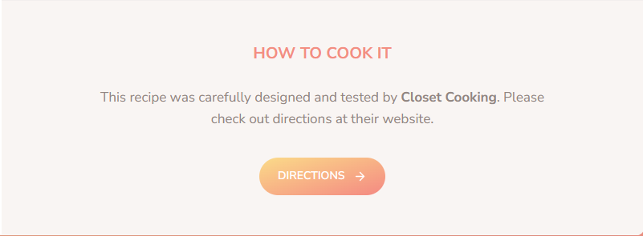
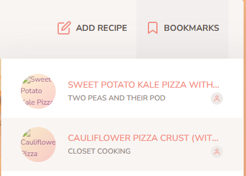
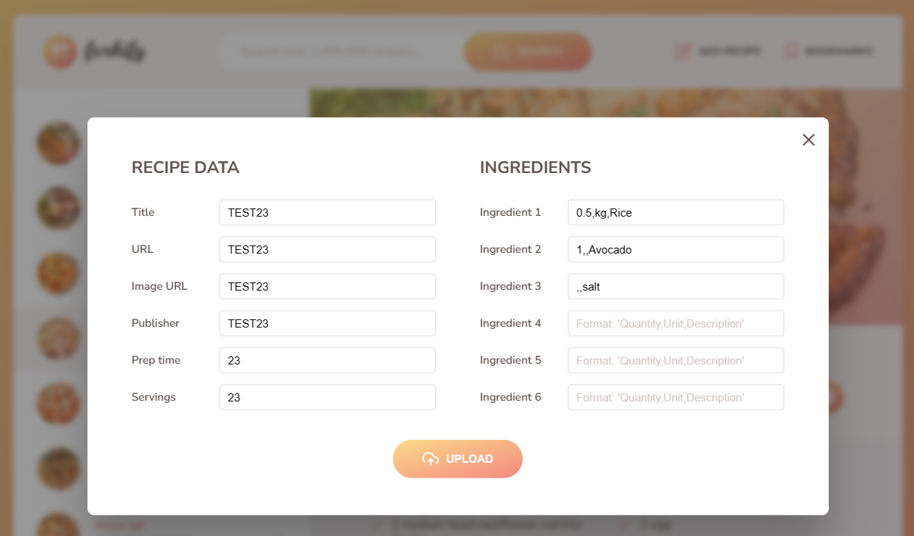

## 第14章 最后的项目

#### 14.1 项目部署

1. 使用`npm init`，创建`packge.json`，得到包管理工具

2. 使用`npm i parcel`，创建捆绑工具，将文件代码转化为浏览器可识别的代码

3. 小提示，启动代码`npm run start`，但可以省略为`npm start`

#### 14.2 初始化加载数据、渲染页面

1. 加载数据，从请求API处获取数据

2. 渲染页面，拿到DOM元素，使用`innerAdjacentHTML`方法加载

3. 补充加载中过程

重要代码如下：

```js
// 1) 加载数据 
        const response = await fetch(
            `https://forkify-api.herokuapp.com/api/v2/recipes/5ed6604591c37cdc054bc886`
            // `https://forkify-api.herokuapp.com/api/v2/recipes/5ed6604691c37cdc054bd0c0`
        )
        const data = await response.json();

        if (!response.ok) throw new Error(`${data.message} (${response.status})`)

        console.log(response, data)

        let {data: {recipe}} = data
        recipe = {
            id: recipe.id,
            image: recipe.image_url,
            ingredients: recipe.ingredients,
            publisher: recipe.publisher,
            servings: recipe.servings,
            sourceUrl: recipe.source_url,
            title: recipe.title,
        }


// 2) 渲染页面 
recipeContainer.insertAdjacentHTML('afterbegin', markup) 

// 3) 加载中 
const renderSpinner = function (parentEl) {
    const markup = `
        <div class="spinner">
          <svg>
            <use href="${icons}#icon-loader"></use>
          </svg>
        </div>
    `;

    parentEl.insertAdjacentHTML('afterbegin', markup)
}
```

#### 14.3 路由标签响应

目的：点击路由后发生数据加载

代码如下：

```js
// 读取多个事件
const array = ['hashchange','load']
array.forEach(event => window.addEventListener(event,showRecipe)) 

// showRecipe代码优化
const id = window.location.hash.slice(1);
        console.log(id)

        if (!id) return;
        // 1）加载食谱
        renderSpinner(recipeContainer)

        const response = await fetch(
            `https://forkify-api.herokuapp.com/api/v2/recipes/${id}`
            // `https://forkify-api.herokuapp.com/api/v2/recipes/5ed6604691c37cdc054bd0c0`
        )
```

#### 14.4 软件结构

考虑的重点：

1. 组织代码，结构

2. 不断优化，可维护性

3. 添加新结构，可拓展性

开发重点：

1. 业务逻辑，解决实际问题、关联业务要做的和需要做的

2. 状态，存储应用的所有数据、UI与状态同步、使用状态管理库

3. 请求库，对AJAX请求进行响应

4. 应用逻辑（路由），编码只关注应用接口、处理导航和UI事件

5. UI层，编码只关心应用的可视化部分、展示应用状态

**MVC架构**

由模型、视图、控制器组成

- 模型：业务逻辑、状态、请求

- 控制器：应用逻辑

- 视图：UI层

**项目结构重构**

主要文件夹`.js/`

1. `model.js`：负责模型

2. `controller.js`：负责控制器

3. `views/`：负责视图

**项目重构**

新生成的文件及文件夹:

1. `views/`：用于存放视图

2. `recipeView.js`：用于请求数据并渲染界面

3. `helpers.js`：封装请求的数据

4. `config.js`：定义全局变量

接入错误与成功提示信息

查询功能：

1. 新生成文件`searchView.js`

2. 实现界面查询功能

3. 返回查询列表，显示在页面左侧

份数调整功能：

1. 在`recipeView.js`中完成份数调整

2. 点击加号，配料分数按比例增加

3. 点击减号，配料分数按比例减少

*因为使用的API文档是V1版本，所以算法是自己的版本*

分页功能：

1. 新生成文件`paginationView.js`

2. 获取查询后得到的列表

3. 按照每页10项进行分页

收藏功能：

1. 新生成文件`bookmarksView.js`

2. 菜品详情页点击收藏功能后，将菜品放置在顶部栏的收藏夹里

3. 点击收藏夹里的菜品，获取菜品的详情页

4. 取消收藏，将在收藏夹里的菜品进行消除

添加菜品：

1. 打开添加菜品

2. 按照定义的规则，填写相关的信息

3. 点击提交，完成菜品上传

4. 将链接改为当前上传菜品的`id`，并实现菜品获取

5. 在菜品列表、菜品详情页、收藏夹中添加人为添加图标

*因为API文档版本的原因，上传的功能没有实现成功，以V2版本的数据要求进行上传，服务器报错，status：500*

**界面效果图**

1. 顶部栏


2. 侧边栏



3. 分页



4. 详情页-1



5. 详情页-2



6. 收藏



1. 添加



#### 14.5 文档编写

编写示例如下

```js
/**
     * 将接收到的对象渲染在DOM上
     * @param {Object | Object[]} 这是将被渲染的数据
     * @param {boolean} [render = true] 如果为false，将创建食谱字符串
     * @returns {undefined | string} A markup string is returned if render = false
     * @this {Object} View instance
     * @author Lex Sium
     * @todo Finish implementation
     * */

    render(data) {
        if (!data || Array.isArray(data.results) && data.results.length === 0) return this.renderError()
        this._data = data
        const markup = this._generateMarkup()
        this._clear()
        this._parentElement.insertAdjacentHTML('afterbegin', markup)
    }
```