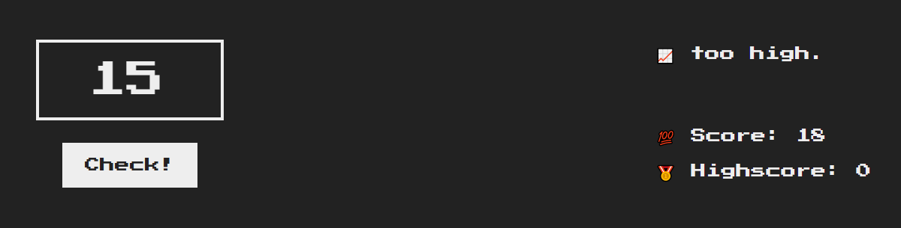
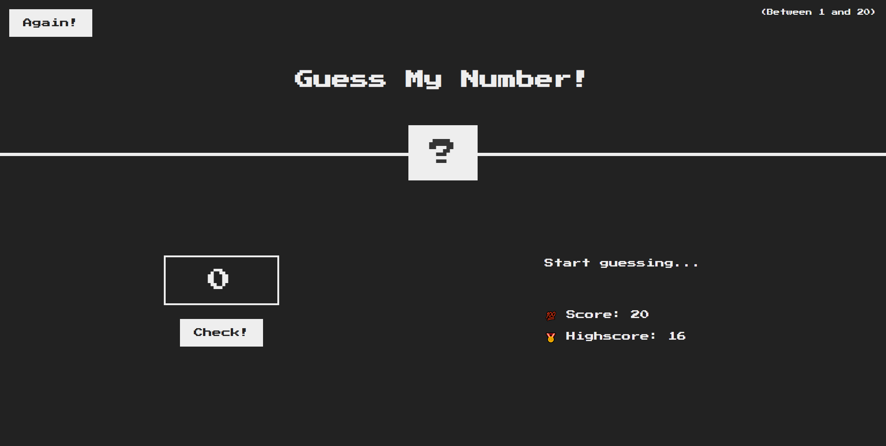

# JavaScript

- javascript学习 于 2023.05.09 开仓

---

## 第3章

### 项目一：猜猜我的数字

#### 前置内容

DOM:代表文档对象模型，HTML的文档结构表示

#### 项目

内容：开发一个猜数字的游戏

具体实现：

1. 输入数据、检测数据，并返回判断

2. 记录操作次数，每操作一次，得分减一

3. 正确时，改变`body`背景颜色，并使猜测按钮失效

4. 重置按钮，操作记录复原、背景颜色改变为黑色

5. 正确数字显示为`?`，正确猜测后显示，错误不显示，重置后显示`?`

6. 显示最高得分`TobScore`，重置不改变最高得分，猜测正确后检测最高得分

#### 页面截图:

1. 开始游戏


2. too low


3. too high



4. correct


5. again



代码如下:

```js
// 设置正确数字
let number = Math.trunc(Math.random()*20 + 1);
console.log("number: ",number);

// check 设置事件监听器，类型为点击事件
document.querySelector(".check").addEventListener("click",function(){
    let guess = document.querySelector(".guess");        // 猜测值    
    let score = document.querySelector(".score");        // 得分
    let message = document.querySelector(".message");    // 提示信息
    let Topnumber = document.querySelector(".number");    // 顶部数字
    let highscore = document.querySelector(".highscore");    // 最高得分
    let check = document.querySelector(".check");        // 猜测按钮

    if(!guess.value) {
    // 未输入数字，设置提示信息
        message.textContent = "😓 no Number."
    }else{
        if (Number(guess.value) > number) {
        // 猜测数字过大
            score.textContent = Number(score.textContent) - 1;
            message.textContent = "📈 too high.";
        } else if (Number(guess.value) < number) {
        // 猜测数字过小
            score.textContent = Number(score.textContent) - 1;
            message.textContent = "📉 too low.";
        } else {
        // 正确情况
        // 设置提示信息
        // 判断最高分数
        // 设置顶部数字
        // 禁用猜测按钮
        // 设置body颜色
            message.textContent = "🎉correct number!";
            if (highscore.textContent === "0") {
                highscore.textContent = score.textContent;
            } else if (highscore.textContent < score.textContent)
                highscore.textContent = score.textContent;
            Topnumber.textContent = guess.value;
            check.disabled = true;
            document.body.style.backgroundColor = "#60b347";
        }
    }
})

// again 设置事件监听器，类型为点击事件
document.querySelector(".again").addEventListener("click",function(){
    // 重新获得正确数字
    number = Math.trunc(Math.random()*20 + 1);
    console.log(number);
    // 重置得分、提示消息、猜测数字、顶部数字、body背景颜色
    document.querySelector(".score").textContent = 20;
    document.querySelector(".message").textContent = "Start guessing...";
    document.querySelector(".check").disabled = false;
    document.querySelector(".guess").value = "";
    document.querySelector(".number").textContent = "?";
    document.body.style.backgroundColor = "#222";
})
```

> Tips:
> 
> 1. 可以继续实现得分为0时的失败信息
> 
> 2. 实现代码重构，将冗余的代码通过函数方法进行调用

---

### 项目二：模态框

内容：实现一个模态框

具体实现:

1. 按钮触发遮盖层、模态框的显现

2. 模态框的按钮触发隐藏遮盖层、模态框的显现

3. 监听事件（遮盖层、模态框按钮、`ESC`）触发显现事件

#### 页面截图

1. 开始页面


2. 模态框


代码如下:

```js
const modal = document.querySelector('.modal');    // 获取模态框
const overlay = document.querySelector('.overlay'); // 获取遮盖层
const btnCloseModal = document.querySelector('.close-modal');    // 关闭模态框
const btnsOpenModal = document.querySelectorAll('.show-modal');    // 开启模态框

const clickOpenListener = function () {
    // modal.classList.remove("hidden","...")  删除多个类选择器语法
    // 打开模态框、遮盖层
    modal.classList.remove("hidden");
    overlay.classList.remove("hidden");
}

const clickCloseListener = function () {
    // 关闭模态框、遮盖层
    modal.classList.add("hidden");
    overlay.classList.add("hidden");
}

for (let i = 0; i < btnsOpenModal.length; i++) {
    // 按钮数组添加监听事件，打开模态框
    btnsOpenModal[i].addEventListener("click", clickOpenListener);
}

// 模态框按钮添加监听事件，关闭模态框
btnCloseModal.addEventListener("click", clickCloseListener);
// 遮盖层按钮添加监听事件，关闭模态框
overlay.addEventListener("click", clickCloseListener);
// 键盘添加监听事件，关闭模态框
document.addEventListener("keydown", function (event) {
    if (event.key === "Escape" && !modal.classList.contains("hidden")) clickCloseListener();
});
```

---