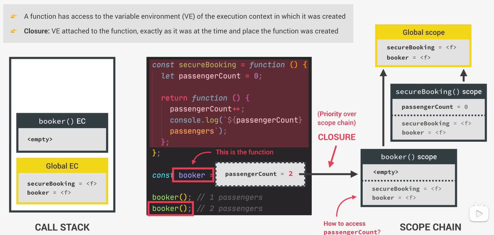

# JavaScript

- javascript学习 于 2023.05.09 开仓

---

## 第6章 函数

#### 1.函数传参

重点：对于默认参数的设置

```js
const bookings = [];

const createBooking = function(flightNumber,passengersNumber = 1,price = 998 * passengersNumber){
    // ES5 的默认参数赋值方法
    // passengersNumber = passengersNumber ?? 1;
    // price = price ?? 998;

    const booking = {
        flightNumber,
        passengersNumber,
        price
    }

    console.log(booking);
    bookings.push(booking);
}

createBooking('NF883');
createBooking('NF883',2,199);
createBooking('NF883',5,299);
createBooking('NF883',6);
createBooking('NF883',undefined,668);
```

#### 2.原始数据与引用数据的变化

内容：传递进入函数中的**原始数据**、**引用数据**在函数中发生二次赋值，**原始数据**不会发生改变，而**引用数据**的内部属性会发生改变

示例：

```js
const flight = `NF556`;
const Bob = {
    name:'Bob Jerry',
    passport:77882211
};

const checkIn = function(flightNum, passenger){
    flightNum = 'NF999'; // 原始数据发生改变
    passenger.name = 'Mr. '+ passenger.name; // 对象数据发生改变

    if (passenger.passport === 77882211){
        console.log(`alert in`);
    }else{
        console.log(`Wrong passport!`);
    }
}

checkIn(flight,Bob);
console.log(flight); // NF556
console.log(Bob); // {name: 'Mr. Bob Jerry', passport: 77882211}
```

#### 3. 函数的多种应用简介

- 变量、对象存储函数

- 函数作为变量应用于其它函数

- 函数返回一个函数

- 回调函数

#### 4. 函数形参

```js
// 去除字符串之间空格
const oneWord = function(string){
    return string.replaceAll(' ','').toLowerCase();
}
// 将首个单词大写
const upperFirstWord = function(string){
    const [first,...others] = string.split(' ');
    return [first.toUpperCase(),...others].join(' ');
}
// 接收函数形参
const transformer = function(str,fn){
    console.log(`Original string: ${str}`);
    console.log(`Transformed string: ${fn(str)}`);
    console.log(`Transformed by: ${fn.name}`);
}
// 调用高阶函数，并传入函数，！！注意并没有在此进行调用
transformer(`JavaScript is the best!`,upperFirstWord);
transformer(`JavaScript is the best!`,oneWord);

// 函数绑定到页面元素上进行使用
const high5 = function (){
    console.log(`😊`);
}

document.body.addEventListener('click',high5);
['Bob','Tom','Jerry','Ding'].forEach(high5);
```

#### 5. 调用内部函数

```js
// 定义内部函数
const greet = function (greeting) {
    return function (name) {
        console.log(`${greeting} ${name} 😊`);
    }
}

// 传递主函数，获得内部函数
const greeterHey = greet('Hey');
greeterHey('David');
greeterHey('Evi');

// 直接调用内部函数
greet('Hello')('Bob');

// 内部函数为箭头函数
const greet2 = function (greeting) {
    return (name) => {
        console.log(`${greeting} ${name} 😊`);
    }
}

greet2('Haloooo')('Tom');

// 全箭头函数
const greet3 = greeting => name => console.log(`${greeting} ${name} 😊`);

greet3('Hayoo')('Jerry');
```

#### 6. call与apply

```js
const lufthansa = {
    airline:'Lufthansa',
    iataCode:'LH',
    bookings:[],
    book(flightNum,name){
        console.log(`${name} booked a seat on ${this.airline} flight ${this.iataCode}${flightNum}`);
        this.bookings.push({flight:`${this.iataCode}${flightNum}`,name})
    }
}

lufthansa.book(239,`Bob Tom`);
lufthansa.book(336,`Jim Lorry`);

const eurowings = {
    name:'Eurowings',
    iataCode: 'EW',
    bookings:[]
}

const book = lufthansa.book;
book.call(eurowings,23,'Bob France'); // 使用call调用

const swiss = {
    airline:'Swiss Air Lines',
    iataCode:'LX',
    bookings:[],
}

book.call(swiss,583,'Bob England'); // 使用call调用
console.log(swiss);

const flightData = [583,'Bob England'];
book.apply(swiss,flightData); // 使用apply调用
console.log(swiss);

book.call(swiss,...flightData);  // apply，可以被call方法替代
console.log(swiss);
```

#### 7.bind方法

```js
const lufthansa = {
    airline: 'Lufthansa',
    iataCode: 'LH',
    bookings: [],
    book(flightNum, name) {
        console.log(`${name} booked a seat on ${this.airline} flight ${this.iataCode}${flightNum}`);
        this.bookings.push({flight: `${this.iataCode}${flightNum}`, name})
    }
}
const eurowings = {
    name: 'Eurowings',
    iataCode: 'EW',
    bookings: []
}
const swiss = {
    airline: 'Swiss Air Lines',
    iataCode: 'LX',
    bookings: [],
}

const book = lufthansa.book;

// bind方法，将函数绑定到指定对象上
const bookEW = book.bind(eurowings);
const bookLH = book.bind(lufthansa);
const bookLX = book.bind(swiss);

bookEW(23, 'Bob Tom');

// bind方法，将函数绑定到指定对象上，并传入部分参数
const bookEW23 = book.bind(eurowings, 224);
bookEW23('Bob Tom');
bookEW23('Bob Jerry');

lufthansa.planes = 300;
lufthansa.buyPlane = function () {
    console.log(this);

    this.planes++;
    console.log(this.planes);
}

// 将buyPlane方法绑定到lufthansad对象上
document.querySelector('.buy').
addEventListener('click', lufthansa.
buyPlane.bind(lufthansa));

const addTax = (rate, value) => value + value * rate;
console.log(addTax(0.1, 200));

// bind方法，不传递对象，传递rate参数
const addVAT = addTax.bind(null, 0.148);

console.log(addVAT(100));
console.log(addVAT(25));


const addRate = function (rate) {
    return function (value) {
        return rate * value + value
    }
}

// 获取内部函数，实现bind方法的效果
const addVAT2 = addRate(0.361);

console.log(addVAT2(100));
console.log(addVAT2(25));
```

#### 挑战一 函数调用

```js
// Coding Challenge #1

/*
Let's build a simple poll app!

A poll has a question, an array of options from which people can choose, and an array with the number of replies for each option. This data is stored in the starter object below.

Here are your tasks:

1. Create a method called 'registerNewAnswer' on the 'poll' object. The method does 2 things:
  1.1. Display a prompt window for the user to input the number of the selected option. The prompt should look like this:
        What is your favourite programming language?
        0: JavaScript
        1: Python
        2: Rust
        3: C++
        (Write option number)

  1.2. Based on the input number, update the answers array. For example, if the option is 3, increase the value AT POSITION 3 of the array by 1. Make sure to check if the input is a number and if the number makes sense (e.g answer 52 wouldn't make sense, right?)
2. Call this method whenever the user clicks the "Answer poll" button.
3. Create a method 'displayResults' which displays the poll results. The method takes a string as an input (called 'type'), which can be either 'string' or 'array'. If type is 'array', simply display the results array as it is, using console.log(). This should be the default option. If type is 'string', display a string like "Poll results are 13, 2, 4, 1".
4. Run the 'displayResults' method at the end of each 'registerNewAnswer' method call.

HINT: Use many of the tools you learned about in this and the last section 😉

BONUS: Use the 'displayResults' method to display the 2 arrays in the test data. Use both the 'array' and the 'string' option. Do NOT put the arrays in the poll object! So what shoud the this keyword look like in this situation?

BONUS TEST DATA 1: [5, 2, 3]
BONUS TEST DATA 2: [1, 5, 3, 9, 6, 1]

GOOD LUCK 😀
*/

const poll = {
    question: 'What is your favourite programming language?',
    options:['0: JavaScript','1: Python','2: Rust','3: C++'],
    answers:new Array(4).fill(0),
    registerNewAnswer(){
        let questions = `${this.question}\n${this.options.join('\n')}\n(Write option number)`;
        let anwser = Number(prompt(questions));

        typeof anwser && anwser <= this.answers.length && this.answers[anwser]++;

        this.displayResults();
        this.displayResults('array');
    },

    displayResults(type = 'string'){
        if(type === `string`){
            console.log(`Poll results are ${this.answers}`)
        }else if(type === `array`){
            console.log(this.answers);
        }
    }
}

document.querySelector('.poll').addEventListener('click',poll.registerNewAnswer.bind(poll));

poll.displayResults.call({answers:[5, 2, 3]},`string`);
poll.displayResults.call({answers:[1, 5, 3, 9, 6, 1]},`array`);
```

#### 8.IIFE(立即调用函数表达式)

内容：创建一个隐蔽的函数，执行期间不影响全局作用域

```js
const runOnce = function(){
    console.log(`the function is never run again`);
}
runOnce();

(function(){  // 立即执行函数
    console.log(`the function is never run again`);
})();

(() => console.log(`the function is also never run again`))();  // 箭头函数示例

{  // 函数作用域
    let a = 1;
    var b = 2;
}

// console.log(a);
console.log(b);
```

#### 9.闭包

概念：

封闭变量执行上下文的环境，在其中创建了函数，可以使用环境中的变量。

特点：

1. 隐蔽函数变量

2. 开放内部函数

3. 内部函数使用函数作用域里的变量

示例代码:

```js
const guest = function(){
    let people = 0;
    return function(){
        people++;
        console.log(`Now ${people} are here.`);
    }
}

const addGuest = guest();

addGuest();
addGuest();
addGuest();

console.dir(addGuest);
```

示例图:

